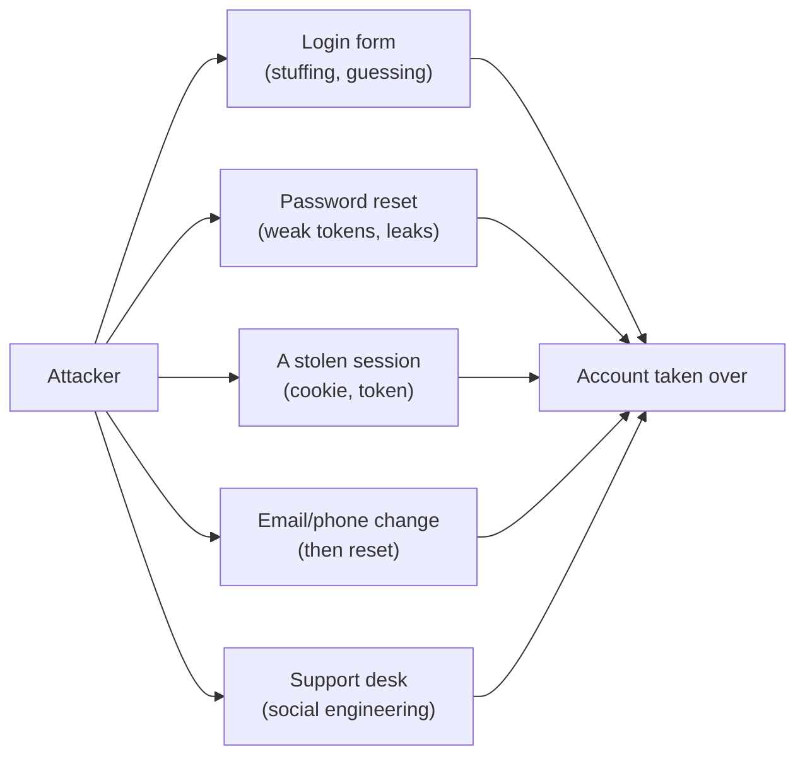

# 7.8 Sessions, recovery & account takeover

Attackers don't care *how* they get into an account, only that they do. A strong password and MFA (chapter 7.7) protect one door, the login form. But an account has others: the "forgot password" link, the session cookie that stays valid for weeks, the email-change form, the support desk, the device that was never logged out. **Account takeover** (**ATO**) is the name for any of these ending with someone else in control of the account.

This chapter walks through each door, how it's attacked, and how to defend it, with snip's labs implementing the two pieces most often done wrong: password-reset tokens and breached-password checks.

## What you'll learn

- **Credential stuffing**, and slowing it without locking real users out.
- **Breached-password checks** with **k-anonymity**: checking a password without revealing it.
- **Account enumeration**: why "no account with that email" is a leak.
- The **session lifecycle**: creation, timeouts, revocation, "log out everywhere".
- **Refresh-token rotation** and reuse detection.
- **Password reset** done properly, and the classic bugs.
- **Changing email or phone** safely, and **detecting** a takeover.

---

## The doors into an account

:::note[Everyday anchor]
A well-locked front door doesn't help if the back door is open, a spare key is under the mat, and the locksmith will make a new key for anyone who sounds confident on the phone. Burglars check every door. So do attackers.
:::



Each door needs its own lock. The rest of this chapter goes through them in turn.

---

## Credential stuffing, and slowing it down

**Credential stuffing** takes username and password pairs leaked from other sites and tries them against yours, from thousands of IP addresses, a few attempts per account. It works because people reuse passwords, and it's the most common way accounts are taken over.

Defences, in layers:

- **MFA** (chapter 7.7). The single biggest defence: a correct password is no longer enough.
- **Rate limits per account and per source** (chapter 8.4). Several failed logins for one account in a short time slows that account down; many failures from one network slows that network down.
- **Throttling, not lockout.** Locking an account after 5 failures sounds safe, but it lets an attacker lock anyone out on purpose: a **denial of service** against your users. Prefer growing delays (the realm file for this chapter's Keycloak lab uses Keycloak's brute-force protection: after 5 failures, a wait that grows with each further failure) and extra checks (a challenge, or requiring MFA) over hard lockouts.
- **Breached-password checks**, at sign-up and password change, and optionally at login.
- **Bot detection and monitoring**: a sudden rise in failed logins across many accounts is an attack in progress, and a metric worth alerting on (chapter 13.4).

### Checking passwords against breaches, without sending them

Checking whether a password has leaked sounds like it requires sending the password to someone who has the leaks. It doesn't. The Pwned Passwords service uses **k-anonymity**:

1. Hash the password with SHA-1: 40 hexadecimal characters.
2. Send only the **first 5** characters.
3. The service returns every leaked hash that starts with those 5 characters (hundreds of them), with a count for each.
4. Compare the remaining 35 characters **locally**.

The service never learns the password, or even its full hash: hundreds of different passwords share any 5-character prefix. snip's `accountsec.BreachCount` implements it, and its test checks the one property that matters, that only the prefix is ever sent:

```go
sum := sha1.Sum([]byte(password))
full := strings.ToUpper(hex.EncodeToString(sum[:]))
prefix, suffix := full[:5], full[5:]
req, err := http.NewRequestWithContext(ctx, http.MethodGet, baseURL+prefix, nil)
req.Header.Set("Add-Padding", "true") // pad responses so their size doesn't leak the prefix's popularity
```

(SHA-1 is fine here: it's used as a lookup key into a public dataset, not to protect anything.) CI runs it against the real service:

```text
"password123"                    seen in breaches 2266543 times
"P@ssw0rd"                       seen in breaches 6421042 times
"correct horse battery staple"   seen in breaches 391 times
```

The last one is a famous example of a *good* passphrase from a well-known comic. It's been used as a real password often enough to appear in breaches 391 times. Any password that's famous, however strong it looks, is on the attackers' lists.

:::info[In the real world]
Current guidance from standards bodies such as NIST has moved away from the rules many sites still use. It recommends **long passwords** (and allowing very long ones, with spaces), **checking new passwords against breached and common lists**, and **no** forced periodic changes or composition rules ("one uppercase, one symbol"), which push people towards predictable patterns like `P@ssw0rd`, and it recommends changing a password when there's evidence it's compromised.
:::

---

## Account enumeration: what your error messages leak

A login form that says "no account with that email" tells an attacker which emails have accounts: a list to target with stuffing and phishing. So does a sign-up form that says "that email is already registered", a reset form that says "we've sent a link" only for real accounts, and a login that takes 200 milliseconds longer for real accounts (because it hashes the password only when the user exists).

The fixes:

- **The same message for every failure**: "Incorrect email or password." "If an account exists for that address, we've sent a link."
- **The same timing**: when the user doesn't exist, hash the submitted password against a dummy hash anyway, so both paths do the same slow work.
- **Sign-up**: send "you already have an account; here's how to log in" by email, rather than saying it on screen.

snip's reset code follows the same principle: one error, `ErrInvalidToken`, whether the token never existed, expired or was already used.

---

## Sessions: the door that stays open

After login, the **session** (chapter 7.2) *is* the user, as far as your server is concerned. Stealing it is as good as stealing the password and the second factor, which is why modern phishing kits aim for the session cookie rather than the password. Treat the session lifecycle as carefully as the login:

- **New ID at login.** Always issue a fresh random session ID when someone logs in, and discard any ID from before. Otherwise an attacker who planted a known session ID in the victim's browser before login is logged in with them: **session fixation**. (The chapter 7.9 relying party does this.)
- **Two timeouts.** An **idle timeout** (no activity for, say, 30 minutes on a banking site, days on a low-risk one) and an **absolute timeout** (re-authenticate after, say, 30 days, however active).
- **Server-side revocation.** Logout must delete the session on the server, not just the cookie in the browser.
- **"Log out everywhere"** and a **list of active sessions** (device, location, last seen), so users can spot and end one they don't recognise.
- **End all sessions on password change or reset**, except perhaps the current one. If an attacker was in the account, a password change must throw them out.
- **Re-authenticate for sensitive actions** (step-up, chapter 7.7).

### Refresh tokens: rotate them, and notice reuse

With token-based logins (chapters 7.2 and 7.3), a short-lived **access token** is paired with a long-lived **refresh token**. The refresh token is the valuable one: it can mint new access tokens for weeks. Two practices limit the damage if it's stolen:

- **Rotation**: every time a refresh token is used, issue a new one and invalidate the old one.
- **Reuse detection**: if an *old*, already-used refresh token is presented again, two parties have a copy, the user and a thief. You can't tell which is which, so revoke the whole chain of tokens and make the user log in again.

```mermaid
sequenceDiagram
    participant U as User's app
    participant X as Thief (stole R1)
    participant S as Auth server
    U->>S: refresh with R1
    S->>U: new access token + R2 (R1 now spent)
    X->>S: refresh with R1
    S->>S: R1 was already used → theft likely
    S->>S: revoke R2 and the whole family
    S-->>X: rejected
    Note over U: next refresh fails; user logs in again
```

---

## Password reset, done properly

A reset link is a temporary key to the account, sent through email: often the weakest door of all. snip's `accountsec.Resets` shows the rules in about 60 lines:

```go
// Issue returns a token to put in the reset link. Send it only to the
// address already on the account, never to one given in the request.
func (r *Resets) Issue(userID string) (string, error) {
	b := make([]byte, 32)
	if _, err := rand.Read(b); err != nil {
		return "", err
	}
	token := base64.RawURLEncoding.EncodeToString(b)
	...
	r.byHash[hashToken(token)] = resetRecord{userID: userID, expires: r.Now().Add(r.TTL)}
	return token, nil
}
```

The rules, and the test that checks each:

| Rule | Why |
|---|---|
| **32 random bytes** from a cryptographic source (chapter 7.1) | Unguessable. Sequential IDs or timestamps can be predicted |
| **Store only a hash** of the token | A database leak can't be used to reset anyone's password |
| **Expire quickly** (15 minutes to an hour) | Old emails in a compromised inbox stay harmless |
| **Single use**, and **a new link cancels older ones** | A link forwarded, logged or cached can't be used again |
| **One error for everything** | No enumeration of valid tokens or accounts |
| **End all sessions** after a successful reset, and **notify** | Throws out an attacker; alerts the real owner |

And three classic bugs to avoid:

- **Host header injection.** If the reset email's link is built from the incoming request's `Host` header, an attacker can request a reset for the victim with `Host: evil.example`, and the victim receives a genuine email with a link to the attacker's domain, carrying a valid token. Build links from **configuration** (snip's `SNIP_BASE_URL`), never from the request.
- **Token leaks through the Referer header.** If the reset page loads a third-party script or image, the browser may send the full URL, token included, to that third party. Use a `Referrer-Policy: no-referrer` header on the reset page (chapter 7.5's security headers), and exchange the token for a short-lived form immediately.
- **Sending the link to an address from the request.** Always send it to the address already on the account.

"Magic link" sign-in (a login link emailed instead of a password) is the same mechanism, with the same rules.

---

## Changing the email address is changing the lock

Changing an account's email or phone number is the quiet takeover: the attacker changes the email, then uses "forgot password" to reset through their own inbox. Protect it:

- **Re-authenticate** (password plus second factor) before the change.
- **Confirm the new address** with a link sent there, and **notify the old address** with a way to undo it ("This wasn't me").
- Consider a **short delay** before the change takes full effect, during which the old address can cancel it.
- The same applies to adding or removing MFA factors and recovery options.

---

## Noticing a takeover in progress

No defence is perfect, so watch for the signs:

- **New device or location**: a login from a country the user has never logged in from, or two logins far apart minutes after each other ("impossible travel").
- **A burst of sensitive changes** after login: email, password, MFA and payout details changed within minutes.
- **Failed-login patterns** across many accounts (stuffing) or many failed MFA prompts on one (fatigue).

Record security events in an **audit log** (chapter 7.4), send the user a notification for each one, and alert your own team on the patterns. The user is often the first to notice, if you tell them.

:::info[Honesty label]
**Exists today:** snip's `accountsec` package (reset tokens and the k-anonymity breach check) with tests, and a CI step that queries the real Pwned Passwords service. The Keycloak lab realm has brute-force protection on. **Not built:** snip itself has no user passwords, sessions or reset flow: its API uses API keys (chapter 7.2). These are the patterns you'd apply, or check that your identity provider applies, in a product with user logins.
:::

---

## Lab

Free. Steps 1–2 run offline; step 3 needs internet access.

1. **Read and run the reset-token tests:**
   ```bash
   cd ~/code/zero-to-prod/snip
   go test -v ./examples/accountsec/...
   ```
   **What to notice:** `TestResetTokensAreSingleUseAndExpire` checks that the stored map never contains the token itself. Change `Issue` to store `token` instead of `hashToken(token)` and watch that test fail.

2. **Add the missing rule.** `Redeem` doesn't end the user's sessions, because the lab has none. Write the function a real service would call after a successful reset, `EndAllSessions(userID string)`, with a test, using an in-memory map of session IDs to users.

3. **Check real passwords, safely:**
   ```bash
   go run ./examples/accountsec/cmd 'password123' 'Summer2025!' 'a sentence nobody has ever used as a password 7x'
   ```
   Try a few passwords you *don't* use (never test a real password on a machine you don't trust). **What to notice:** read `BreachCount` again. The only thing that leaves your machine is `https://api.pwnedpasswords.com/range/` plus 5 characters.

4. **Hunt for enumeration.** On any site you use (your own accounts only), try the login, sign-up and reset forms with an email that has an account and one that doesn't. Do the messages or timings differ? Write down what an attacker could learn.

---

## Self-check

<Quiz
  id="security-account-security"
  questions={[
    {
      q: 'Why is "lock the account after 5 failed logins" often a bad defence against password guessing?',
      options: [
        'Five is too many; attackers only need two or three guesses per account',
        'Attackers can lock anyone out on purpose; delays, rate limits and MFA stop guessing without that',
        'Lockouts leak which usernames exist, and that is its only real weakness',
        'Attackers guess from many IP addresses at once, and a lockout only counts failures per address, so it never triggers',
      ],
      answer: 1,
      explain: 'It lets an attacker lock any user out on purpose; growing delays, rate limits and MFA stop guessing without handing attackers a denial-of-service button. A defence that can be triggered by the attacker against the victim is a new attack.',
    },
    {
      q: 'How does the Pwned Passwords range API check a password without learning it?',
      options: [
        'It encrypts the password with the service’s public key before sending it',
        'Only 5 characters of the SHA-1 hash are sent; matching the returned list happens locally',
        'It sends the full hash, which cannot be reversed into the password',
        'It checks the password in memory on the service’s side and promises never to write it to disk or logs',
      ],
      answer: 1,
      explain: 'Only the first 5 characters of the SHA-1 hash are sent; the service returns all leaked hashes with that prefix, and the comparison happens locally. k-anonymity: hundreds of different hashes share any prefix, so the prefix reveals almost nothing.',
    },
    {
      q: 'Why must a new session ID be issued at login?',
      options: [
        'Session IDs wear out after one use, so each login needs a new one',
        'Otherwise an ID an attacker planted before login would share the session',
        'To make the cookie smaller once the user’s details are added to it',
        'Browsers delete cookies set before login once the user signs in',
      ],
      answer: 1,
      explain: 'Otherwise an attacker who planted a known ID in the victim’s browser before login would share the logged-in session (session fixation). The privilege level changed, so the identifier must change with it.',
    },
    {
      q: 'An already-used refresh token is presented again. What should the server conclude and do?',
      options: [
        'It’s a harmless retry after a network blip; accept it and move on',
        'Two parties hold it, so it was likely stolen: revoke the family, force a login',
        'Issue two new tokens, one for each copy, and log the event',
        'Reject that one request as a stale retry, but leave the newer token in the family working as before',
      ],
      answer: 1,
      explain: 'Two parties have the token, so it was probably stolen: revoke the whole token family and require a fresh login. Rotation with reuse detection turns token theft into a detectable event.',
    },
    {
      q: 'A reset email’s link is built from the request’s Host header. What can an attacker do?',
      options: [
        'Nothing; the email still goes to the real owner’s inbox',
        'Forge the Host so the real email links to the attacker’s site, with a valid token',
        'Read the victim’s inbox through the link that the email contains',
        'Change the victim’s password directly, without any token at all',
      ],
      answer: 1,
      explain: 'Request a reset for the victim with a forged Host, so the genuine email contains a link to the attacker’s domain with a valid token. Build absolute URLs from configuration, never from request headers.',
    },
  ]}
/>

<details>
<summary>Support receives a call: "I've lost my phone and my laptop was stolen, I can't log in, please remove my two-factor and change my email." What should the process be?</summary>

This is exactly the call an attacker would make, so the process must work without relying on the agent's judgement of how genuine the caller sounds:

- **No changes on the call.** The agent starts a documented recovery process instead.
- **Verify through channels the attacker is unlikely to control**: a recovery code, a still-logged-in device, the email address *already* on the account (not a new one), or for high-value accounts, identity verification by a specialised provider.
- **Add a waiting period** (for example 24–72 hours) before removing MFA, with notifications to every channel on the account and an easy "this wasn't me" cancellation.
- **Change one thing at a time**: restore access first; changing the email address is a separate step, again with notification to the old address.
- **Log everything** in the audit log, and **review** these recoveries: a spike is an attack pattern.
- **Train support** that pressure ("I'm the CEO", "it's urgent") is itself a warning sign, and give them a process that lets them say no without blame.

</details>

<details>
<summary>Your login endpoint takes 250 ms for existing users and 5 ms for unknown ones. Why is that a problem, and how do you fix it?</summary>

It's an account enumeration leak through **timing**: anyone can measure the response time and learn which emails have accounts, even if the error message is identical. The difference comes from the slow password hash (chapter 7.1), which only runs when the user exists.

Fix: always do the same work. When the user doesn't exist, verify the submitted password against a fixed dummy hash created with the same algorithm and cost settings, and discard the result. Both paths now take about 250 ms. Also keep the response identical (status code, body, headers, cookies), rate-limit the endpoint (chapter 8.4), and add a test that compares the two paths so a future refactor doesn't reintroduce the difference.

</details>
