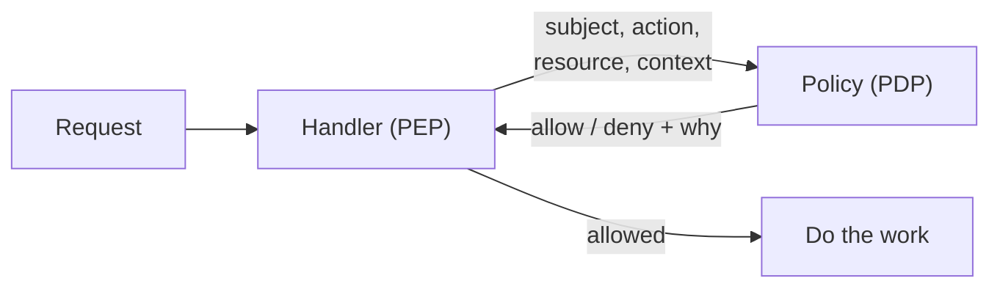

# 7.10 Authorization at scale: policies & relationships

In chapter 7.4, snip's authorization fit in one line of SQL: `WHERE owner_id = $1`. Each API key owns its links, and nobody else can see them. That's correct, and for a product with one kind of user, it's enough.

Now imagine snip succeeds. Customers want **teams**, where colleagues edit each other's links. They want to **share** a folder of campaign links with an agency. Enterprise customers want roles from their identity provider to decide who's an admin (chapter 7.9). Your **support staff** need to look at a customer's links to fix a problem, but only when that customer asked. And deleting links should require a recent second factor (chapter 7.7). Each rule is simple. Written as `if` statements scattered through the handlers, together they become the part of the code nobody dares change, and the source of the most damaging bugs: one user reading another's data.

This chapter is about keeping authorization **correct as it grows**: separating decisions from code, writing policies you can test, and modelling sharing with relationships.

## What you'll learn

- Where authorization should happen: **enforcement points** and **decision points**.
- Why roles alone stop scaling (**role explosion**), and what attributes add.
- **Policy as code** with **Open Policy Agent**: snip's links policy, with tests.
- **Relationship-based access control** (**ReBAC**), the model behind Google's Zanzibar, built from scratch.
- **Filtering lists** without checking every row.
- **Impersonation**, **break-glass** access and **audit**.
- How to **test** authorization.

---

## Decisions and enforcement are different jobs

:::note[Everyday anchor]
At an office building, the guard at each door checks your badge, but doesn't decide who's allowed where. That's decided centrally, by whoever manages access, and written down. The guard asks, "may this badge enter this floor now?", and acts on the answer. Change the rules centrally, and every door follows.
:::

Two roles, with standard names:

- The **policy enforcement point** (**PEP**) is the code at the door: the HTTP handler or gateway that stops the request if the answer is no.
- The **policy decision point** (**PDP**) answers the question: may *this subject* do *this action* on *this resource*, in *this context*?



Separating them means the rules live in one place, written in one style, reviewable and testable on their own, instead of being spread across 40 handlers. The decision point can be a library in the same process, a sidecar next to it, or a central service: the trade-off is latency and availability (every request waits for the answer, and if the decision point is down, the safe answer is **deny**) against having one source of truth.

There's also a question of **where** to enforce. A gateway can enforce coarse rules ("is this a valid token with the `links:write` scope?", chapter 7.3), but only the service knows who owns link `q3-launch`. **Object-level decisions belong in the service**, and chapter 7.4's most common API vulnerability, broken object-level authorization, is what happens when they're left to the gateway.

---

## Roles, attributes, and where each breaks

Chapter 7.4 introduced the basic models. Here's how they behave as a product grows:

- **Role-based** (**RBAC**): permissions attach to roles (`link-editor`), and people get roles. Easy to understand and to audit. It breaks down through **role explosion**: as soon as permissions depend on *which* thing, you need `editor-of-folder-launch`, `editor-of-folder-q3`, and so on, until there are more roles than people.
- **Attribute-based** (**ABAC**): decisions use attributes of the subject, resource and context: "support staff may *read* links in a tenant *while* they have an open ticket for that tenant". Very expressive, and exactly right for context such as time, tickets or MFA age. It can become hard to answer "who can access this?", because the answer depends on attribute values at request time.
- **Relationship-based** (**ReBAC**): permissions come from relationships between specific things: "ada is an editor of folder launch; links in that folder inherit its editors". This is how sharing works in document and file products, and it doesn't explode, because relationships are data, not roles.

Real systems combine them. snip's policy below uses ownership, roles and attributes; the relationship model follows.

---

## Policy as code with Open Policy Agent

**Open Policy Agent** (**OPA**) is a widely used open-source decision point. Policies are written in its language, **Rego**, and OPA answers queries: you send the input as JSON, and it returns the decision. Because policies are files, they're **versioned, reviewed and tested** like code. That's **policy as code**.

snip's links policy (`snip/deploy/opa/links.rego`) encodes the rules from the start of this chapter:

```rego
package snip.links

import rego.v1

default allow := false

# Owners manage their own links.
allow if {
	same_tenant
	input.resource.owner == input.subject.id
	input.action in {"read", "update"}
}

# Tenant roles (RBAC): editors can read and change any link in their tenant,
# viewers can read them.
allow if {
	same_tenant
	some role in input.subject.roles
	input.action in role_actions[role]
}

# Deleting is destructive, so it needs a recent second factor (step-up
# authentication, chapter 7.7), by the owner or a tenant admin.
allow if {
	input.action == "delete"
	same_tenant
	can_delete
	recent_mfa
}

# Support staff (ABAC) may read a link in any tenant, but only while working
# an open support ticket for it, and never change anything.
allow if {
	"support" in input.subject.roles
	input.action == "read"
	input.subject.support_ticket.tenant == input.resource.tenant
	input.subject.support_ticket.open
}
```

How to read it: `allow` is true if **any** of the `allow if { … }` blocks is true, and each block is true only if **every** line inside it is. `default allow := false` is **deny by default** (chapter 7.4): if no rule matches, the answer is no, including for actions nobody thought of (the tests check that `export` is denied).

The policy also explains itself. Denials come with reasons, for the audit log:

```rego
reasons contains "deleting needs a second factor in the last 15 minutes" if {
	input.action == "delete"
	same_tenant
	can_delete
	not recent_mfa
}
```

Asked by snip's service over HTTP (OPA running as a server), the answer for Ada deleting her own link, an hour after her last second factor, looks like this:

```text
$ curl -s localhost:8181/v1/data/snip/links -d '{"input": {"subject": {"id": "ada", "tenant": "acme",
    "roles": [], "mfa_age_seconds": 3600}, "action": "delete",
    "resource": {"type": "link", "owner": "ada", "tenant": "acme"}}}'
{"result":{"allow":false,"can_delete":true,"reasons":["deleting needs a second factor in the last 15 minutes"],...}}
```

Two minutes after a fresh second factor, `allow` is `true`.

### Policies have tests

`links_test.rego` holds eight tests, one per rule and one per important *denial*. CI runs `opa fmt`, `opa check --strict` and `opa test` on every push:

```rego
test_support_reads_only_with_an_open_ticket_for_that_tenant if {
	...
	links.allow with input as {"subject": with_ticket, "action": "read", "resource": link}
	not links.allow with input as {"subject": with_ticket, "action": "update", "resource": link}
	not links.allow with input as {"subject": base, "action": "read", "resource": link}
	...
}
```

```text
PASS: 8/8
```

Notice how many of the assertions are `not links.allow`. For authorization, the important tests are the ones proving something is **refused**. A policy with only "allowed" tests can grant everything to everyone and still pass.

:::info[In the real world]
OPA is widely used for Kubernetes admission control (rejecting unsafe manifests before they're applied), API gateways and microservices. Other policy languages exist, such as **Cedar**, designed to be analysable (tools can prove properties like "no rule lets a viewer delete"). The idea is the same: decisions out of handlers, into a tested, reviewed policy.
:::

---

## Relationships: how sharing works at scale

Sharing a folder with a team, where the team's members can then see every link in the folder, is awkward in roles and attributes, and natural as **relationships**. Google described its system for this in a 2019 paper, **Zanzibar**, which handles permissions for products such as Drive and YouTube. Open-source systems inspired by it, such as SpiceDB and OpenFGA, are now common.

The model has two parts:

1. **Relationship tuples**, stored as data: `folder:launch#owner@user:ada` ("ada is the owner of folder launch"), `folder:launch#viewer@team:growth#member` ("members of team growth are viewers of folder launch"), `link:q3-launch#parent@folder:launch`.
2. **Rules** for each object type: "owners are also editors, editors are also viewers", and "a link's viewers include its parent folder's viewers".

snip's `examples/rebac` implements the core in about 100 lines. The test sets up exactly the sharing above:

```go
s.Write(
	Tuple{"folder:launch", "owner", "user:ada"},
	Tuple{"folder:launch", "viewer", "team:growth#member"},
	Tuple{"team:growth", "member", "user:grace"},
	Tuple{"link:q3-launch", "parent", "folder:launch"},
	Tuple{"link:private", "owner", "user:bob"},
)
```

and checks the consequences: Grace can **view** `link:q3-launch` (member of growth → viewer of the folder → viewer of the link in it), but can't **edit** it; Ada can edit it (owner of the folder → editor of the folder → editor of its links); nobody but Bob sees `link:private`. Two more tests show what makes the model powerful and safe:

- **Removing one tuple revokes everything derived from it.** Take Grace out of the team, and her access to every folder shared with the team, and every link in those folders, disappears at once. No list of permissions to clean up.
- **Cycles terminate.** Team A contains team B contains team A: the check stops instead of looping forever, and grants nothing.

What real systems add on top: a schema language, storage built for billions of tuples, caching, and **consistency**. The Zanzibar paper's example is the "new enemy" problem: remove someone from a folder, then add a secret document to it. If the permission check reads stale data from before the removal, the removed person sees the new document. Zanzibar solves it with consistency tokens that say "check against data at least this fresh".

---

## Listing is harder than checking

"Can Ada read link X?" is one question. "Show Ada all the links she can read" is millions of questions, if you check each link one by one. Two workable approaches:

- **Push the rule into the query.** Chapter 7.4's rule, "scope the query, not the result": `WHERE tenant_id = $1 AND (owner_id = $2 OR ...)`, or Postgres **row-level security**. Fast, but only practical for rules that translate into SQL.
- **Ask the authorization system for the list.** ReBAC systems offer "lookup resources": which objects does this user have `viewer` on? They're built to answer it efficiently.

What you must **not** do: fetch 50 rows, filter out the ones the user can't see, and return 12. Pagination breaks, counts leak ("page 1 of 9"), and one forgotten filter becomes a data leak.

---

## Admins, impersonation and break-glass access

The most powerful permissions are the ones most likely to be abused or stolen, so they deserve the most structure:

- **Least privilege for staff** (chapter 12.4's idea, applied to your product): support gets read-only access, scoped by a ticket, as in snip's policy.
- **Impersonation** ("log in as this customer" to reproduce a bug) should be explicit and visible: a banner on every page, read-only by default, time-limited, recorded in the audit log with who, whom and why, and ideally announced to the customer.
- **Break-glass access**: an emergency path to full access (the SSO provider is down, the only admin left), sealed, heavily logged, alerting everyone when used, and reviewed afterwards.
- **Separation of duties**: for the riskiest actions (granting admin, deleting a tenant), require a second person to approve.
- **Audit logs** (chapter 7.4) for every authorization decision that matters, with the policy's reasons. When a customer asks "who accessed our data last month?", the answer should be a query, not an investigation.

---

## Testing authorization so it stays correct

Authorization bugs are rarely clever. They're a missing check in one new endpoint, or a rule that was right until someone added a role. The defences are boring and effective:

- **Deny-by-default tests**: for every endpoint, a request with no credentials, and with another tenant's credentials, must fail. Generate these from the route list, so a new endpoint without a check fails CI.
- **A permission matrix**: roles × actions × resource situations (own, same tenant, other tenant), with the expected answer in a table and a test that runs every cell. snip's OPA tests are a small version of this.
- **Policy tests in CI**, as above, including the refusals.
- **Review policy changes like code changes**, because they are.

:::info[Honesty label]
**Exists today:** snip enforces ownership in SQL (chapter 7.4); the OPA links policy with 8 tests, checked in CI; and the relationship checker with tests. **Not built:** snip's API doesn't call OPA or the relationship checker. snip has no teams, folders, sharing or support access: the policy and tuples model the product it would become. Wiring the policy in means building an input (subject from the API key or ID token, action, resource from the database) in each handler and calling OPA, which is a good exercise.
:::

---

## Lab

Free and local. Steps 1–3 need Docker; step 4 needs Go.

1. **Run the policy tests:**
   ```bash
   cd ~/code/zero-to-prod/snip
   docker run --rm -v "$PWD/deploy/opa:/policy:ro" openpolicyagent/opa:1.21.0 test -v /policy
   ```

2. **Break a rule and watch a test catch it.** Copy the policy folder, and in the copy remove `recent_mfa` from the delete rule. Run the tests on the copy. Which test fails? Now restore it, and instead delete `test_delete_needs_recent_mfa`, and make the same change: nothing fails. That's why the refusal tests matter.

3. **Ask OPA as a service would:**
   ```bash
   docker run -d --name opa -p 8181:8181 -v "$PWD/deploy/opa:/policy:ro" \
     openpolicyagent/opa:1.21.0 run --server --addr :8181 /policy
   curl -s localhost:8181/v1/data/snip/links -d '{"input": {"subject": {"id": "ada", "tenant": "acme",
     "roles": [], "mfa_age_seconds": 3600}, "action": "delete",
     "resource": {"type": "link", "owner": "ada", "tenant": "acme"}}}'
   ```
   Change `mfa_age_seconds` to `60`, then change the resource's `tenant` to `globex`, and read the reasons each time.

4. **Model sharing with relationships:**
   ```bash
   go test -v ./examples/rebac/...
   ```
   Add a rule and a test: links in a folder get the folder's **editors** as editors too (already there), and a new relation, `commenter`, which editors also have, but viewers don't. Then add a nested folder (`folder:launch/emea` with parent `folder:launch`) and check that access flows down two levels.

5. **Write a permission matrix.** For snip's three roles plus owner and support, and the actions read, update and delete, write the table of expected answers for "own link", "same tenant", "other tenant". Compare it cell by cell with what the policy does (write a test for any cell you're unsure about).

---

## Self-check

<Quiz
  id="security-authorization-at-scale"
  questions={[
    {
      q: 'Why should "may user X change link Y?" be decided in the service rather than only at the API gateway?',
      options: [
        'Gateways are slow, and every check there adds a network hop',
        'Only the service knows who owns link Y; a gateway only sees the token',
        'Gateways can’t read request headers, so they never see the token',
        'It shouldn’t; one check at the edge is safer than many copies of the same rule spread across services',
      ],
      answer: 1,
      explain: 'Only the service knows who owns link Y; gateways can check tokens and scopes, but object-level decisions need the object. Broken object-level authorization is what happens when the object check is missing.',
    },
    {
      q: 'What is role explosion?',
      options: [
        'Roles being deleted by accident when a team is reorganised',
        'Needing a role for each permission-and-resource pair, until roles outnumber people',
        'Too many admins, because each newly created role starts with admin rights until someone trims it back',
        'A denial-of-service attack that floods the policy engine with roles',
      ],
      answer: 1,
      explain: 'When permissions depend on which thing, relationships or attributes model it better than roles.',
    },
    {
      q: 'In snip’s Rego policy, what happens for an action no rule mentions, like "export"?',
      options: [
        'It’s allowed, since nothing forbids it',
        'Denied, by default allow := false',
        'OPA returns an error, which snip treats as allowed',
        'It depends on the role: admins may, others may not',
      ],
      answer: 1,
      explain: 'It’s denied, because of default allow := false. Deny by default: new actions are refused until a rule explicitly allows them.',
    },
    {
      q: 'In a Zanzibar-style system, Grace is removed from team growth. What happens to her access to links in folders shared with the team?',
      options: [
        'Nothing, until an admin removes her from each folder',
        'It disappears at once: it came from the tuple that was removed',
        'It remains until her cached tokens expire, up to 30 days',
        'Only edit access goes; she keeps viewing, which is the safe default',
      ],
      answer: 1,
      explain: 'It disappears immediately, because it was derived from the membership tuple that was removed. Access is computed from relationships at check time, so removing one relationship revokes everything it implied.',
    },
    {
      q: 'Why are tests that assert a refusal ("not allow") especially important for authorization?',
      options: [
        'They run faster, since OPA stops at the first rule that says no',
        'An allow-everything policy passes every "allowed" test; only refusals catch it',
        'OPA refuses to load a policy without at least one refusal test',
        'They cut logging costs, since refused requests aren’t recorded',
      ],
      answer: 1,
      explain: 'A policy that allows everything passes every "allowed" test; only refusal tests catch over-permissive changes. The dangerous bugs are the ones that grant too much.',
    },
  ]}
/>

<details>
<summary>snip adds a "list my team's links" endpoint. The first implementation fetches 100 links for the tenant, asks OPA about each, and returns the allowed ones. What's wrong, and what would you do instead?</summary>

Problems:

- **Performance**: 100 decisions per page; with more links per tenant, it gets worse.
- **Pagination and counts break**: a page may come back with 3 links (or none) while more exist; totals leak how many links exist that the user can't see.
- **Fragility**: filtering after fetching means a missed filter is a data leak.

Better options:

- For rules that translate into SQL (tenant, owner, role-based visibility), **put them in the query**: `WHERE tenant_id = $tenant AND (...)`, or enforce with Postgres row-level security (chapter 7.4), and keep OPA for per-object actions like delete.
- For sharing-based access, use a ReBAC system's **lookup** operation to get the IDs the user can see, then query those.
- OPA also supports **partial evaluation**: it can turn a policy into conditions on unknown values, which can be translated into a query filter. Powerful, but more complex; worth it when the same rules must drive both checks and lists.

Whatever you choose, test it with a user from another tenant and assert that the list is empty.

</details>

<details>
<summary>A customer asks: "Can your support staff see our links?" How should the product be designed so you can answer honestly and precisely?</summary>

The answer should be "only under these conditions, and you can see every time it happened":

- Support access is **read-only** and **scoped to an open ticket** for that customer (as in snip's policy), not a blanket admin role.
- Access is **time-limited** and requires the support person's own strong authentication (phishing-resistant MFA, chapter 7.7).
- Optionally, the customer must **approve** access per ticket, or can turn support access off.
- Every access is written to an **audit log** with who, when, which ticket and what was viewed, and the customer can see their own audit log.
- **Impersonation**, if it exists, is visible (banner), read-only by default and logged the same way.
- The rules live in the **policy**, with tests proving support can't update or delete, and can't read without a ticket, so the answer to the customer is backed by code and CI, not just a promise.

</details>
