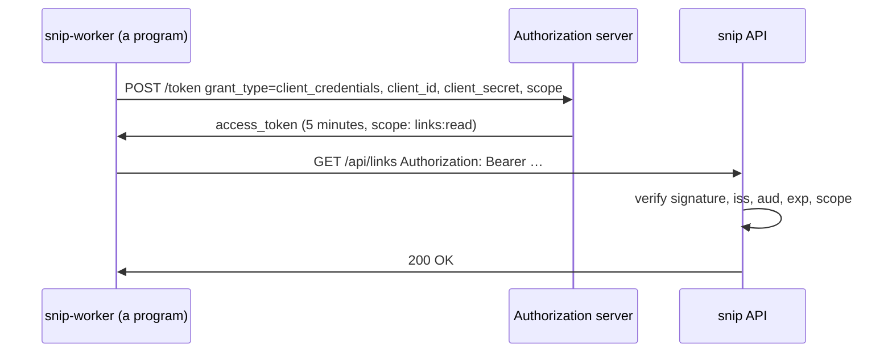

# 7.3 OAuth 2.0 & OpenID Connect

You've clicked "Sign in with Google" hundreds of times, and granted apps permission to "view your calendar" or "access your repositories". Behind those buttons are two standards that nearly every modern system uses: **OAuth 2.0**, for granting limited access *without sharing passwords*, and **OpenID Connect**, built on top of it, for logging people in. They have a reputation for being confusing — lots of roles, flows, tokens and redirects. This chapter untangles them with one running example, then gives you a tiny, readable authorization server (about 200 lines of Go) that you can run, poke and break, so the moving parts stop being abstract.

## What you'll learn

- The problem OAuth solves — **delegated access** without handing over passwords — and its four **roles**.
- The **authorization code flow with PKCE**, step by step: the redirect dance behind every "Sign in with…" button.
- **Scopes**, **access tokens** and **refresh tokens** — and why access tokens are short-lived.
- **OpenID Connect**: the **ID token**, **discovery** and **JWKS** — how apps log users in with someone else's accounts.
- **Client credentials** for machine-to-machine access, the security checks that matter, and when to use a real identity provider.

---

## The problem: sharing access without sharing passwords

Before OAuth, if a printing service wanted your photos from another site, it asked for **your password** on that site. It then had *full* access to your account — it could read your messages, change your password, delete everything — forever, until you changed your password (which also cut off every other app).

OAuth replaces that with **delegation**: you tell the photo site, *"let this printing service read my photos, for a while"*. The printing service gets a **token** with exactly that permission. It never sees your password, it can't do anything else, and you can revoke it at any time.

:::note[Everyday anchor]
OAuth is a **valet key**. Many cars come with a special key for parking attendants: it starts the engine and opens the door, but won't open the boot or the glovebox, and you can take it back whenever you like. You don't hand the valet your house keys and your bank card "just in case".
:::

### The four roles

| Role | In "print my photos" | In snip terms |
|---|---|---|
| **Resource owner** | You — the photos are yours | A snip user |
| **Client** | The printing service (the app wanting access) | A dashboard app wanting to read your links |
| **Authorization server** | The photo site's login and consent service — issues tokens | An identity provider (Google, Okta, Keycloak, Auth0…) |
| **Resource server** | The photo site's API — accepts tokens | snip's API |

The key idea: the **client never sees the user's password**. The user logs in directly with the authorization server, which then hands the client a token.

---

## The authorization code flow (with PKCE)

This is the flow behind nearly every "Sign in with…" and "Allow access" screen, for web and mobile apps alike:

```mermaid
sequenceDiagram
    participant U as You (browser)
    participant C as Client app
    participant A as Authorization server
    participant R as Resource server (API)
    U->>C: Click "Connect my account"
    C->>C: Make a random code_verifier; hash it → code_challenge
    C->>U: Redirect to A: client_id, scope, redirect_uri, state, code_challenge
    U->>A: Log in (password + MFA) and approve "read your links"
    A->>U: Redirect back to redirect_uri with ?code=…&state=…
    U->>C: (browser follows the redirect)
    C->>C: Check state matches what it sent
    C->>A: POST /token: code + code_verifier (+ client secret if it has one)
    A->>A: Check code, and hash(code_verifier) == code_challenge
    A->>C: access_token (+ refresh_token, + id_token with OIDC)
    C->>R: GET /api/links  Authorization: Bearer <access_token>
    R->>C: 200 OK
```

Step by step:

1. **The client redirects you to the authorization server**, saying who it is (`client_id`), what it wants (`scope`), where to send you back (`redirect_uri`), plus two security values: **`state`** and a **`code_challenge`**.
2. **You log in there** — on the authorization server's own page, not the client's — and approve the requested access.
3. **The authorization server redirects you back** to the client with a one-time **authorization code**.
4. **The client exchanges the code for tokens** by calling the authorization server directly, server-to-server — the tokens never pass through your browser's address bar.

The two security values:

- **`state`** — a random value the client remembers and checks when you come back. It stops an attacker from tricking your browser into completing *their* login flow (a CSRF attack, chapter 7.5).
- **PKCE** ("pixie", Proof Key for Code Exchange) — the client invents a random secret **`code_verifier`**, sends only its hash (**`code_challenge`**) at the start, and reveals the verifier when exchanging the code. If an attacker intercepts the code (for example, via a malicious app on a phone), it's useless without the verifier. PKCE is now recommended for **all** clients.

:::info[In the real world]
You may see older tutorials using the **implicit flow** (tokens returned directly in the URL) or the **password grant** (the app collects your password). Both are deprecated in current OAuth security guidance (the OAuth 2.0 Security Best Current Practice, and OAuth 2.1). Use the authorization code flow with PKCE.
:::

---

## Scopes and tokens

### Scopes: exactly what's allowed

A **scope** is a named permission the client asks for, and the user approves: `links:read`, `calendar.readonly`, `repo`. The token records the granted scopes, and the resource server checks them on every request. Ask for the **minimum** you need — users trust apps that ask for less.

### Access tokens and refresh tokens

- An **access token** is the bearer token (chapter 7.2) the client sends to the API. It's **short-lived** — often 5 to 60 minutes — so a leaked one expires quickly.
- A **refresh token** is longer-lived and used only with the authorization server, to get new access tokens without making the user log in again. It can be **revoked** (for example, when the user clicks "remove access"), which stops new access tokens being issued.

This split is how OAuth solves chapter 7.2's JWT revocation problem: access tokens can be self-contained JWTs checked without any lookup, because they expire soon, while the revocable refresh token controls the long-term access.

---

## OpenID Connect: logging in, not just accessing

OAuth 2.0 answers *"what may this app do?"* — it's about **authorization**. It doesn't define how the app learns **who the user is**. People bent OAuth into doing login anyway, in incompatible ways, until **OpenID Connect** (OIDC) standardised it as a thin layer on top.

OIDC adds:

- **The `openid` scope** — asking for it turns an OAuth flow into a login.
- **An ID token** — a **JWT** (chapter 7.2), signed by the identity provider, stating who logged in:

  ```json
  {
    "iss": "https://accounts.google.com",
    "sub": "110169484474386276334",
    "aud": "your-client-id.apps.googleusercontent.com",
    "email": "ada@example.com",
    "email_verified": true,
    "iat": 1790283789,
    "exp": 1790287389,
    "nonce": "n-0S6_WzA2Mj"
  }
  ```

  `sub` (subject) is the user's permanent, unique ID at that provider — use it, not the email (emails change), as the key for the user in your database.

- **Discovery** — every provider publishes a JSON document at `/.well-known/openid-configuration` listing its endpoints and supported features, so libraries configure themselves from one URL.
- **JWKS** (JSON Web Key Set) — the provider's **public keys**, published at a URL in the discovery document. Your app fetches them to verify ID-token and access-token signatures without calling the provider on every request.

### Validating a token: the checks that matter

Signature checking isn't enough. A token is only valid for *you* if **all** of these hold:

| Check | Why |
|---|---|
| **Signature** verifies with the provider's published key, using an expected algorithm | Proves the provider issued it and it wasn't modified — never accept `"alg": "none"` |
| **`iss`** is the provider you expect | Tokens from another issuer aren't vouching for anything you trust |
| **`aud`** is *your* client ID or API | A token issued to *another* app must not be accepted by yours |
| **`exp`** is in the future | Expired tokens are dead |
| **`nonce`** matches (ID tokens) | Stops a captured token being replayed into a new login |

Use a well-maintained OIDC library to do this (chapter 7.1's "don't roll your own crypto"); but know what it checks, so you can recognise a misconfiguration.

---

## Machine to machine: client credentials

Not every client acts for a human. snip's click worker, a nightly report job, or one of your services calling another has **no user** to log in. For them there's the **client credentials** grant: the program authenticates as *itself*, with its own client ID and secret, and receives an access token directly — no browser, no redirects.



Compared with a long-lived API key (chapter 7.2), the program's secret goes only to the authorization server, the tokens it uses everywhere else expire in minutes, and permissions are managed centrally. Cloud platforms go further with **workload identity**: the platform itself vouches for the program, so there's no secret at all (chapter 12.4).

---

## A tiny authorization server you can read

Real identity providers are large and complex. To see the core clearly, the handbook includes **tinyauth** (`snip/examples/tinyauth/main.go`): a toy authorization server *and* protected API in one program, using only Go's standard library. It implements discovery, JWKS, the client credentials grant, and token verification with scope checks.

Signing a token is just chapter 7.1's signatures plus Base64 (chapter 1.3):

```go
// sign builds a JWT: base64url(header).base64url(claims).base64url(signature).
func sign(claims map[string]any) string {
	header, _ := json.Marshal(map[string]string{"alg": "EdDSA", "typ": "JWT", "kid": keyID})
	payload, _ := json.Marshal(claims)
	unsigned := b64(header) + "." + b64(payload)
	return unsigned + "." + b64(ed25519.Sign(privateKey, []byte(unsigned)))
}
```

And verifying it performs exactly the checks in the table above — algorithm and key, signature, issuer, audience, expiry:

```go
if header["alg"] != "EdDSA" || header["kid"] != keyID {
	return nil, errors.New("unexpected algorithm or key") // never trust "alg": "none"
}
if !ed25519.Verify(publicKey, []byte(parts[0]+"."+parts[1]), sig) {
	return nil, errors.New("bad signature")
}
if claims["iss"] != issuer || claims["aud"] != audience {
	return nil, errors.New("wrong issuer or audience")
}
if exp, _ := claims["exp"].(float64); time.Now().Unix() >= int64(exp) {
	return nil, errors.New("token expired")
}
```

A few details worth noticing in the full file: client secrets are compared with **`subtle.ConstantTimeCompare`**, so how long the comparison takes can't reveal how many characters matched; a client only ever receives scopes it's **registered** for, whatever it asks for; and tokens last **five minutes**.

:::danger[A teaching toy, not a product]
tinyauth has no user login, no consent screen, no refresh tokens, no key rotation, no rate limiting, and it keeps secrets in code. It exists so you can *see* OAuth. For real systems, use a real identity provider.
:::

---

## Using a real identity provider

In production, you almost never build this yourself. You use an **identity provider** (IdP):

- **Hosted**: Auth0/Okta, Microsoft Entra ID, Google Identity, AWS Cognito, Firebase Auth, Clerk.
- **Self-hosted, open source**: **Keycloak**, Authentik, ZITADEL, Ory.

The IdP handles passwords, MFA, passkeys, account recovery, "Sign in with Google/GitHub", brute-force protection and audit logs — years of security work. Your application becomes an **OIDC client**: it redirects users to the IdP, receives tokens, validates them, and maps the stable `sub` to its own user record. Companies also use IdPs for **single sign-on** (SSO): employees log in once and reach every internal tool, often via OIDC or the older XML-based standard **SAML**. Chapter 7.9 covers single sign-on in depth, from the application's side, with a real Keycloak.

:::warning[What can go wrong]
- **Not validating `aud`.** Your API accepts tokens issued to a completely different app — any app on the same provider can call your API as its users.
- **Loose redirect URI matching.** If the authorization server accepts any redirect under a domain, attackers redirect codes to themselves. Register exact redirect URIs.
- **Skipping `state` or PKCE.** Opens the door to login CSRF and stolen authorization codes.
- **Using the email as the user's ID.** Emails change and can be reassigned; use `iss` + `sub`.
- **Storing tokens where scripts can read them** (browser `localStorage`) in apps vulnerable to XSS. Prefer secure, HttpOnly cookies set by your backend (a "backend for frontend").
- **Long-lived access tokens.** Keep them short; rely on revocable refresh tokens.
:::

---

## Lab

Free, on your own computer.

1. **Read a real discovery document.**
   ```bash
   curl -s https://accounts.google.com/.well-known/openid-configuration | jq '{issuer, authorization_endpoint, token_endpoint, jwks_uri, scopes_supported}'
   curl -s https://www.googleapis.com/oauth2/v3/certs | jq '.keys[] | {kid, alg, kty}'
   ```
   Every OIDC library starts by reading exactly these two documents.

2. **Run tinyauth and play every role.**
   ```bash
   cd ~/code/zero-to-prod/snip
   go run ./examples/tinyauth
   ```
   In a second terminal:
   ```bash
   curl -s localhost:9000/.well-known/openid-configuration | jq .
   curl -s localhost:9000/jwks.json | jq .                         # the PUBLIC key only

   # a program gets a token (client credentials); "admin" is silently not granted
   TOKEN=$(curl -s -X POST localhost:9000/token -d grant_type=client_credentials \
     -d client_id=snip-worker -d client_secret=worker-secret \
     -d scope="links:read admin" | jq -r .access_token)

   echo "$TOKEN" | cut -d. -f2 | tr '_-' '/+' | base64 -d 2>/dev/null; echo   # read the claims (padding warnings are harmless)
   curl -s localhost:9000/api/links -H "Authorization: Bearer $TOKEN"      # 200
   ```

3. **Break it four ways.** Predict the result before each:
   ```bash
   curl -s -X POST localhost:9000/token -d grant_type=client_credentials -d client_id=snip-worker -d client_secret=nope      # wrong secret
   DASH=$(curl -s -X POST localhost:9000/token -d grant_type=client_credentials -d client_id=dashboard -d client_secret=dashboard-secret -d scope=links:write | jq -r .access_token)
   curl -s localhost:9000/api/links -H "Authorization: Bearer $DASH"                  # token without links:read
   curl -s localhost:9000/api/links -H "Authorization: Bearer ${TOKEN%.*}X.${TOKEN##*.}"   # tampered token
   ```
   Then restart tinyauth (<kbd>Ctrl</kbd>+<kbd>C</kbd>, run again) and retry `$TOKEN`: it fails, because tinyauth generates a new signing key on start. That's **key rotation** in miniature — and why real providers publish several keys at once, identified by `kid`, during a rotation.

4. **Read the code.** Open `snip/examples/tinyauth/main.go` and find: where secrets are compared in constant time; where requested scopes are filtered; every check in `verify`. Which check in the "What can go wrong" box does tinyauth *not* need to worry about, and why? (Hint: redirects.)

## Self-check

<Quiz
  id="security-oauth-and-oidc"
  questions={[
    {
      q: 'What problem did OAuth 2.0 originally solve?',
      options: [
        'Encrypting the tokens a service hands to other apps',
        'Letting an app use your data elsewhere without your password, revocably',
        'Logging users in to many websites with one password, which is where its name comes from',
        'Replacing HTTPS for API traffic between two companies',
      ],
      answer: 1,
      explain: 'OAuth delegates limited, revocable access via tokens, instead of sharing full credentials.',
    },
    {
      q: 'What does PKCE protect against in the authorization code flow?',
      options: [
        'Weak passwords typed on the provider’s login page',
        'An intercepted code being exchanged for tokens by an attacker',
        'Tokens being read out of the browser’s local storage by a malicious extension or script',
        'A forged ID token signed with the wrong key',
      ],
      answer: 1,
      explain: 'The client proves it started the flow by revealing the code_verifier whose hash it sent earlier. A stolen code alone is useless.',
    },
    {
      q: 'What does OpenID Connect add on top of OAuth 2.0?',
      options: [
        'Encryption of all tokens, so apps can’t read what’s inside',
        'Standard login: an openid scope, signed ID token, discovery, keys',
        'Refresh tokens, which OAuth 2.0 on its own doesn’t have',
        'Scopes, so apps can ask for less than full access',
      ],
      answer: 1,
      explain: 'OAuth is about authorization (what an app may do). OIDC standardises authentication (who the user is) with the ID token.',
    },
    {
      q: 'Your API validates token signatures but not the aud claim. What is the risk?',
      options: [
        'None; a valid signature proves the token was meant for you',
        'Tokens the provider issued to other apps would work on yours',
        'Tokens would be accepted after they expire, since aud is where the expiry is checked',
        'The API would reject tokens from its own login page',
      ],
      answer: 1,
      explain: 'The signature proves the provider issued the token, not that it was issued for you. Always check the audience.',
    },
  ]}
/>

<details>
<summary>Why are OAuth access tokens usually short-lived, while refresh tokens last much longer?</summary>

Access tokens are sent to APIs on **every** request, so they're the most exposed — and they're often self-contained JWTs that APIs verify **without a lookup**, which means they **can't be revoked** before they expire. Making them short-lived (minutes) limits the damage if one leaks. Refresh tokens are sent **only** to the authorization server, far less often, and the server **can** revoke them — so they can safely live longer and keep users logged in. Together they give you both speed (no lookup per request) and control (revocation within minutes).

</details>

<details>
<summary>snip uses long-lived API keys. When would it make sense to switch to OAuth/OIDC instead?</summary>

When snip gains **people logging in through a browser or app** (a dashboard), OIDC with an identity provider gives them passwords, MFA, "Sign in with Google" and SSO without snip building any of it. When **third-party apps** want to act on behalf of snip users, OAuth's delegated, scoped, user-approved tokens are the standard answer — sharing API keys would give them everything. And for **internal services** (like the worker), client credentials or workload identity replace long-lived secrets with short-lived tokens. API keys remain a fine, simple choice for developers scripting against their own account — many platforms offer both.

</details>
