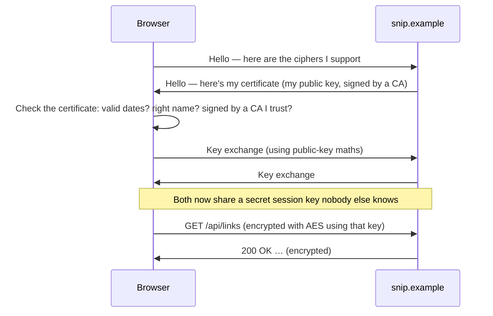

# 7.1 Security literacy: hashing, encryption, TLS

Security can feel like a field for specialists, full of intimidating maths. But almost everything a backend engineer does securely rests on four or five ideas that fit on a single page: **hashing**, **encryption**, **signatures**, **randomness** and **certificates**. You've already used them without noticing — Git commit IDs are hashes (chapter 3.1), SSH keys are public-key cryptography (chapter 2.6), and every `https://` request uses TLS (chapter 1.5). This chapter explains each idea in plain words, shows where snip uses it, and — just as importantly — teaches you to spot the common, costly confusions: "Base64 is encryption", "we hash passwords with SHA-256", "we'll write our own crypto".

## What you'll learn

- The difference between **encoding**, **hashing** and **encryption** — and why confusing them causes real breaches.
- **Hash functions**, their properties, and why passwords need **slow, salted** hashing (bcrypt, Argon2) — while snip's API keys don't.
- **Symmetric encryption** (one shared key) and **public-key encryption** (a key pair), and **digital signatures**.
- **Secure randomness**: why `crypto/rand` and never `math/rand` for anything secret.
- How **TLS** and **certificates** make HTTPS private and trustworthy — and how to inspect them yourself.

---

## Encoding, hashing, encryption: three different things

| | Reversible? | Needs a key? | Purpose | Example |
|---|---|---|---|---|
| **Encoding** | Yes, by anyone | No | Represent data in a different format | Base64, URL-encoding, UTF-8 (chapter 1.3) |
| **Hashing** | **No** — one-way | No | A fixed-size fingerprint of data | SHA-256, bcrypt |
| **Encryption** | Yes — **only with the key** | Yes | Keep data secret | AES, TLS |

The classic mistakes:

- **Treating encoding as protection.** A password Base64-encoded in a config file is a password in plain sight (chapter 1.3's lab decoded one instantly).
- **"Encrypting" passwords.** If you can decrypt them, so can an attacker who steals the key. Passwords must be **hashed**, not encrypted.
- **Hashing something you'll need back.** A hash is a one-way street; you can't recover the original.

:::note[Everyday anchor]
**Encoding** is translating a letter into Morse code — anyone with the chart can read it. **Encryption** is locking the letter in a safe — only someone with the key can read it. **Hashing** is taking the letter's fingerprint — you can check whether a letter matches it, but you can never rebuild the letter from the fingerprint.
:::

---

## Hash functions: fingerprints for data

A **cryptographic hash function** takes any input — a word, a file, a whole database — and produces a fixed-size output, the **hash** (or digest). SHA-256 always produces 256 bits, usually written as 64 hex characters (chapter 1.3):

```text
SHA-256("snip")  = b0e6a23a…  (64 hex characters in full)
SHA-256("Snip")  = 1a030e90…  (one capital letter: completely different)
```

The properties that make it useful:

1. **Deterministic** — the same input always gives the same hash.
2. **One-way** — given a hash, you can't compute the input (except by guessing inputs and hashing them).
3. **Avalanche effect** — change one character and the hash changes completely.
4. **Collision-resistant** — it's practically impossible to find two different inputs with the same hash.

Where you meet hashes:

- **Integrity**: download checksums, Go's `go.sum` (chapter 4.3), Docker image digests (chapter 9.4) — "is this exactly the file I expected?"
- **Identity**: Git commit IDs (chapter 3.1) — the ID *is* a hash of the content.
- **Storing secrets you only need to check**: passwords and API keys.

:::warning
Old hash functions **MD5** and **SHA-1** are broken — researchers can produce collisions. Don't use them for anything security-related. Use **SHA-256** (or SHA-3/BLAKE2) for fingerprints and integrity.
:::

---

## Passwords: slow, salted hashing

A website must check your password at login, but should never be able to *tell anyone* what it is — not even its own engineers, and certainly not an attacker who steals the database. So it stores a **hash**, and at login it hashes what you typed and compares.

But a plain fast hash like SHA-256 is **wrong for passwords**, for two reasons:

- **Guessing is fast.** Humans pick guessable passwords. A modern graphics card computes **billions** of SHA-256 hashes per second, so an attacker with a stolen hash can try every common password, every dictionary word, and every short combination in minutes.
- **Identical passwords have identical hashes.** Everyone whose password is `summer2026` has the same hash, and attackers use precomputed tables of hashes for common passwords.

Password hashing fixes both:

- A **salt**: a random value generated for each user and stored next to the hash. `hash(salt + password)` means identical passwords get different hashes, and precomputed tables are useless.
- A **deliberately slow** algorithm — **Argon2id** (the current recommendation), **bcrypt** or **scrypt** — tuned so one hash takes, say, 50–250 milliseconds. Unnoticeable for one login; ruinous for an attacker trying billions of guesses.

A bcrypt hash, as stored in a database, looks like this:

```text
$2a$12$R9h/cIPz0gi.URNNX3kh2OPST9/PgBkqquzi.Ss7KIUgO2t0jWMUW
└┬┘└┬┘└────────salt (22 chars)──────┘└────────hash────────────┘
 │  └ cost factor: 2^12 rounds — raise it as computers get faster
 └ algorithm
```

The algorithm, cost and salt are stored inside the string itself, so verifying needs only that one value. In Go, `golang.org/x/crypto/bcrypt` gives you `GenerateFromPassword` and `CompareHashAndPassword` — you never handle salts by hand.

### Why snip hashes API keys with plain SHA-256

snip doesn't have passwords; it has **API keys**. And it hashes them with fast SHA-256 — on purpose. From `internal/auth/keys.go`:

```go
// HashKey returns the SHA-256 of key, hex-encoded. A fast hash is fine here
// (unlike for passwords) because keys are long and random: there is nothing
// to brute-force. If the database leaks, the hashes are useless on their own.
func HashKey(key string) string {
	sum := sha256.Sum256([]byte(key))
	return hex.EncodeToString(sum[:])
}
```

Slow hashing exists to protect **weak, human-chosen** secrets. snip's keys are **32 random characters** from a 62-character alphabet — about 190 bits of randomness. Guessing one by brute force would take longer than the age of the universe, even at billions of guesses per second. So a fast hash is perfectly safe for them — and it matters, because snip checks a key on **every** API request, where a 100 ms bcrypt would be a serious cost. Knowing *why* a rule exists lets you know when it applies.

---

## Secure randomness

Keys, salts, session tokens and snip's slugs all need **unpredictable** random values. Computers are deterministic, so "random" numbers come from generators:

- **`math/rand`** (and `Math.random()` in JavaScript, `random` in Python) is fast and fine for simulations or shuffling a playlist — but its output can be **predicted** by anyone who sees enough of it.
- **`crypto/rand`** reads from the operating system's cryptographically secure generator, fed by unpredictable hardware events. Its output can't be predicted.

**Anything security-related uses `crypto/rand`.** snip's key generator does (`internal/auth/keys.go`):

```go
func GenerateKey() string {
	var b strings.Builder
	b.WriteString(keyPrefix)                         // "snip_" — makes leaked keys easy to recognise
	max := big.NewInt(int64(len(keyChars)))
	for i := 0; i < 32; i++ {
		n, err := rand.Int(rand.Reader, max)         // crypto/rand, not math/rand
		if err != nil {
			panic("crypto/rand unavailable: " + err.Error())
		}
		b.WriteByte(keyChars[n.Int64()])
	}
	return b.String()
}
```

The `snip_` prefix is a small, real-world touch: secret scanners (GitHub's, for example) look for recognisable prefixes to catch keys accidentally committed to public repositories. Many providers do the same (`ghp_` for GitHub tokens, `sk_` for Stripe secret keys).

---

## Encryption: keeping data secret

### Symmetric encryption: one shared key

**Symmetric** encryption uses **the same key** to lock and unlock. The standard algorithm is **AES** (Advanced Encryption Standard), used in a mode like **AES-GCM** that both encrypts and detects tampering. It's extremely fast — modern CPUs have dedicated instructions for it — and it protects most of the world's data at rest: disk encryption, database encryption, encrypted backups.

Its limitation: both sides need the same key. How do you get a secret key to someone across the internet without an eavesdropper seeing it?

### Public-key (asymmetric) encryption: a key pair

**Asymmetric** cryptography uses a **pair** of mathematically linked keys (chapter 2.6):

- The **public key** can be shared with anyone.
- The **private key** is kept secret.
- What one key locks, only the other can unlock.

Anyone can encrypt a message with your **public** key, and only you, with your **private** key, can decrypt it. No shared secret needed in advance. Common algorithms: **RSA**, and elliptic-curve algorithms like **ECDSA** and **Ed25519** (the `ed25519` in your SSH key).

Public-key operations are much slower than AES, so real systems use them only to **agree on a shared symmetric key**, then switch to fast AES for the actual data. That's exactly what TLS does.

:::note[Everyday anchor]
Public-key encryption is a letterbox. Anyone can post a letter through the slot (encrypt with the public key), but only the owner has the key to open the box and read the letters (decrypt with the private key). Symmetric encryption is a shared house key: fast and simple, but you first have to get a copy to the other person safely.
:::

### Digital signatures: proving who wrote something

Run the key pair the other way round and you get **signatures**. You create a signature over some data with your **private** key; anyone can check it with your **public** key. A valid signature proves the data came from the private key's holder **and** wasn't changed since.

You use signatures constantly: SSH proves your identity with one (chapter 2.6), software updates are signed so your computer knows they're genuine, and many login tokens (JWTs, chapter 7.2) are signed so a server can trust them without looking anything up.

---

## TLS: how HTTPS actually works

**TLS** (Transport Layer Security) wraps an HTTP connection in encryption (chapter 1.5). It combines everything above:



1. The server presents a **certificate**: its **public key** plus its **name** (`snip.example`), **signed** by a **Certificate Authority** (CA).
2. The browser checks the signature against the CAs it already trusts (built into your OS and browser), the name, and the dates. That proves it's talking to the real `snip.example`, not an impostor.
3. The two sides use public-key maths to agree on a fresh **session key** that an eavesdropper can't work out — even one recording everything.
4. Everything after that is encrypted with fast **symmetric** encryption and protected against tampering.

The result is chapter 1.5's three guarantees: **privacy**, **integrity**, **authenticity**.

### Certificates and CAs

A **Certificate Authority** is an organisation trusted to check that whoever requests a certificate for `snip.example` really controls `snip.example`. **Let's Encrypt** issues free certificates automatically, and today most of the web uses it or a similar service. Certificates expire — Let's Encrypt's have lasted 90 days, and the industry is moving to even shorter lifetimes — so renewal must be **automated** — tools like `certbot`, or Kubernetes' **cert-manager** (chapter 10.3), handle it.

In snip's architecture, TLS is **terminated** at the front door — the reverse proxy (chapter 8.3) or Ingress holds the certificate, decrypts traffic, and forwards it to snip over the private network. snip itself speaks plain HTTP behind it.

:::info[In the real world]
Expired certificates are one of the most common causes of sudden, total outages — for small sites and for very large companies alike — because a certificate that worked yesterday stops working at a precise moment, for everyone. Automate renewal, and monitor expiry dates with alerts well in advance (chapter 13.4).
:::

---

## The golden rule: don't roll your own crypto

Every tool in this chapter has subtle traps: nonces that must never repeat, comparisons that leak timing information, modes that look secure but aren't. Experts get them wrong. So:

- **Use well-known, maintained libraries** (Go's `crypto/*`, `golang.org/x/crypto`) and **high-level functions** (`bcrypt.GenerateFromPassword`, not "SHA-256 plus my own salt scheme").
- **Use standard protocols** — TLS, not a custom encrypted channel; signed tokens from a standard library, not hand-made ones.
- **Follow current guidance**, such as the OWASP cheat sheets, which are updated as algorithms age.

:::warning[What can go wrong]
- **Encoding mistaken for encryption.** Base64 "protected" secrets are public secrets.
- **Passwords with fast or unsalted hashes** (MD5, SHA-1, plain SHA-256). Stolen databases get cracked in hours.
- **`math/rand` for tokens.** Predictable tokens let attackers guess other users' sessions or reset links.
- **Hard-coded encryption keys** in source code or Git. Anyone with the repository can decrypt everything (chapter 7.6).
- **Disabling certificate checks** "to make it work" (`curl -k`, `InsecureSkipVerify: true`). It silently removes the authenticity guarantee — and tends to reach production.
- **Expired certificates.** Automate renewal and alert before expiry.
:::

---

## Lab

Free, on your own computer. `openssl` and `shasum`/`sha256sum` are preinstalled on macOS and most Linux systems.

1. **Watch the avalanche effect.**
   ```bash
   printf 'snip' | shasum -a 256        # macOS; on Linux you can also use: sha256sum
   printf 'Snip' | shasum -a 256        # one capital letter: a completely different hash
   printf 'snip' | shasum -a 256        # same input, same hash, every time
   ```

2. **Encoding vs encryption.**
   ```bash
   printf 'my secret' | base64                                   # encoding: anyone can reverse it
   printf 'my secret' | openssl enc -aes-256-cbc -pbkdf2 -a -pass pass:correct-horse > secret.txt
   cat secret.txt                                                # encrypted: gibberish
   openssl enc -d -aes-256-cbc -pbkdf2 -a -pass pass:wrong-key < secret.txt      # fails: wrong key
   openssl enc -d -aes-256-cbc -pbkdf2 -a -pass pass:correct-horse < secret.txt  # my secret
   rm secret.txt
   ```

3. **Sign and verify with a key pair.**
   ```bash
   openssl genpkey -algorithm ed25519 -out private.pem         # the private key — keep secret
   openssl pkey -in private.pem -pubout -out public.pem        # the public key — share freely
   echo "deploy version 1.4.2" > release.txt
   openssl pkeyutl -sign -rawin -inkey private.pem -in release.txt -out release.sig
   openssl pkeyutl -verify -rawin -pubin -inkey public.pem -in release.txt -sigfile release.sig   # Signature Verified Successfully
   echo "deploy version 6.6.6" > release.txt                   # tamper with the message
   openssl pkeyutl -verify -rawin -pubin -inkey public.pem -in release.txt -sigfile release.sig   # Signature Verification Failure
   rm private.pem public.pem release.txt release.sig
   ```

4. **Inspect a real certificate.**
   ```bash
   echo | openssl s_client -connect github.com:443 -servername github.com 2>/dev/null \
     | openssl x509 -noout -subject -issuer -dates
   ```
   You'll see who the certificate is for (`subject`), which CA signed it (`issuer`), and when it expires (`notAfter`). That's everything your browser checks behind the padlock.

5. **Read snip's key code.** Open `snip/internal/auth/keys.go`. Find where `crypto/rand` is used, where the key is hashed, and the comment explaining why SHA-256 is acceptable here but wouldn't be for passwords.

## Self-check

<Quiz
  id="security-security-literacy"
  questions={[
    {
      q: 'Which statement about Base64 is correct?',
      options: [
        'It is a strong encryption method',
        'It is an encoding anyone can reverse without a key — it protects nothing',
        'It is a password hashing algorithm',
        'It requires a private key to decode',
      ],
      answer: 1,
      explain: 'Encoding changes the format, not the secrecy. Encryption needs a key; hashing is one-way.',
    },
    {
      q: 'Why should passwords be stored with bcrypt or Argon2 rather than plain SHA-256?',
      options: [
        'SHA-256 output is too short',
        'Fast hashes let attackers test billions of guesses per second; slow, salted hashes make stolen hashes very expensive to crack',
        'bcrypt can be decrypted if the user forgets their password',
        'SHA-256 is not a real hash function',
      ],
      answer: 1,
      explain: 'Human passwords are guessable. Salts defeat precomputed tables and duplicate-password detection; deliberate slowness defeats mass guessing.',
    },
    {
      q: 'snip hashes API keys with fast SHA-256. Why is that acceptable?',
      options: [
        'API keys are not secret',
        'The keys are long random values (~190 bits), so there is nothing guessable to brute-force — and keys are checked on every request, where speed matters',
        'SHA-256 is slower than bcrypt',
        'It is not acceptable; it is a bug',
      ],
      answer: 1,
      explain: 'Slow hashing protects weak, human-chosen secrets. Long random keys are infeasible to guess, so a fast hash is safe and avoids a costly slow hash on every API call.',
    },
    {
      q: 'In TLS, what does the certificate prove?',
      options: [
        'That the server is fast',
        'That the public key really belongs to the named site, because a trusted Certificate Authority signed it',
        'That the data is compressed',
        'That the user is logged in',
      ],
      answer: 1,
      explain: 'The CA’s signature binds the site’s name to its public key. That is what stops an impostor from pretending to be snip.example.',
    },
  ]}
/>

<details>
<summary>Explain, with the letterbox analogy, why TLS uses both public-key and symmetric encryption.</summary>

Public-key encryption solves the **key-sharing problem**: anyone can "post" through the server's public letterbox without meeting beforehand. But it's **slow** — too slow to lock every byte of every web page. Symmetric encryption (a shared house key) is **fast**, but needs both sides to have the same key first. So TLS uses the public-key letterbox **once**, at the start, to safely agree on a fresh shared key, then switches to fast symmetric encryption for all the actual data. Best of both.

</details>

<details>
<summary>A teammate proposes generating password-reset tokens with <code>math/rand</code> seeded by the current time. What's wrong, and what should they use?</summary>

`math/rand` is **predictable**: its output follows from its seed, and "the current time" is easy to guess to within a few seconds. An attacker who requests a reset for someone else's account could generate the likely tokens and take over the account. Reset tokens are secrets, so they must come from **`crypto/rand`** (like snip's `GenerateKey`), be long enough to be unguessable (at least 128 bits), expire quickly, and be single-use. Ideally store only a hash of the token, just like snip's API keys.

</details>
