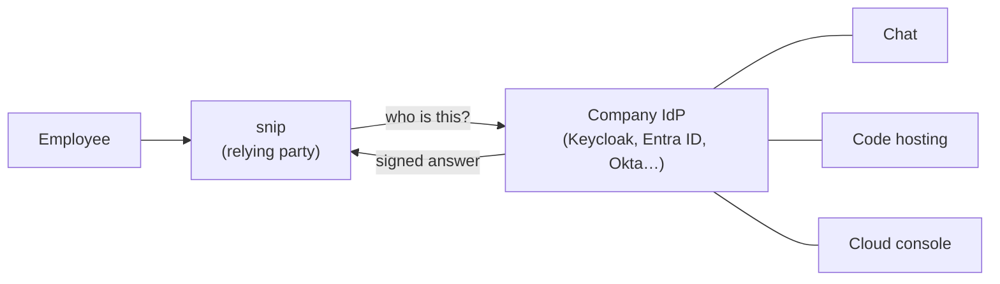

# 7.9 Single sign-on: OIDC, SAML & SCIM

A company of 500 people uses maybe 100 tools: email, chat, code hosting, the cloud console, the HR system, and snip. Without **single sign-on**, that's 50,000 separate accounts, each with its own password, its own MFA setup, and its own forgotten admin who left two years ago but can still log in. With single sign-on, each person has **one** identity at the company's **identity provider**, every tool trusts it, and when someone leaves, disabling that one identity closes every door.

That's why "Does it support SSO?" is one of the first questions business customers ask about any product, and why understanding it is part of building one. This chapter covers the whole picture: the protocols (OpenID Connect and SAML), what your application must check, how a product serves many companies with different identity providers, and how accounts are created and, more importantly, removed.

## What you'll learn

- **Identity providers**, **relying parties** and **federation**.
- **OpenID Connect sign-in** from the application's side, built from scratch and tested against a real **Keycloak**.
- The checks on an ID token, and what happens when each is skipped.
- **SAML**: how it works, and its classic **signature wrapping** attacks.
- **Enterprise SSO** in a product with many customers: **domain verification** and enforcing SSO.
- **Provisioning** and **deprovisioning** with **SCIM**.
- **Logout** across systems, and **account linking** mistakes.

---

## One identity, many applications

:::note[Everyday anchor]
A conference badge. You show your ID once at registration, and get a badge. Every room, talk and lunch queue checks the badge, not your passport. The organisers can cancel your badge centrally, and every door stops letting you in. Nobody at the coffee stand needs to know your passport number.
:::

The roles:

- The **identity provider** (**IdP**) holds the accounts and does the actual authentication: passwords, MFA, passkeys (chapter 7.7). Examples: Microsoft Entra ID, Okta, Google Workspace, and open-source Keycloak.
- Each application that trusts it is a **relying party** (**RP**, the OpenID Connect term) or **service provider** (**SP**, the SAML term). Your product is one.
- **Federation** is the trust relationship between them, set up once by exchanging configuration: URLs, identifiers and public keys.



Two things follow from the design. First, your application **never sees the password**: it receives a **signed statement** from the IdP saying who logged in and how. Second, the security of every application now depends on the IdP, so it's the most valuable target in the company, and where MFA and monitoring matter most.

There are two families of use:

- **Workforce identity**: a company's own staff signing in to internal and bought tools. This is what "enterprise SSO" means.
- **Customer identity** (sometimes CIAM): your product's own users, including "Sign in with Google" or "Sign in with GitHub" (social login).

The protocols are the same; the risks differ, as you'll see.

---

## OpenID Connect sign-in, from the application's side

Chapter 7.3 explained OAuth 2.0 and OpenID Connect (OIDC) and built a toy authorization server. Now you're on the other side: the application that lets people sign in. snip's `examples/oidcrp` is a complete relying party in under 500 lines of standard-library Go, comments included, so every step is visible. (In production, use a maintained library: this one exists to be read.)

The flow, as the relying party runs it:

```mermaid
sequenceDiagram
    participant B as Browser
    participant A as snip (relying party)
    participant I as IdP (Keycloak)
    A->>I: discovery: GET /.well-known/openid-configuration, then the public keys
    B->>A: GET /login
    A->>A: new state, nonce and PKCE verifier; remember them
    A->>B: redirect to IdP with state, nonce, PKCE challenge
    B->>I: log in (password, MFA…)
    I->>B: redirect to /callback?code=…&state=…
    B->>A: GET /callback
    A->>A: state matches one of ours?
    A->>I: exchange code + PKCE verifier + client secret (server to server)
    I->>A: ID token (signed JWT) + access token
    A->>A: verify the ID token: 6 checks
    A->>B: our own session cookie
```

Three random values protect three different things:

| Value | Stops |
|---|---|
| **state** | Login CSRF: an attacker making your browser complete *their* login |
| **nonce** | Replaying an ID token from another login |
| **PKCE verifier** | A stolen authorization code being redeemed by someone else |

### The six checks on an ID token

The **ID token** is a JWT (chapter 7.2) signed by the IdP. Everything the application trusts depends on verifying it properly. `VerifyIDToken` does these checks, in this order:

```go
// 1. Only the algorithm we expect. Never "none", and never an HMAC
//    algorithm keyed with the public key ("algorithm confusion").
if header.Alg != "RS256" {
	return nil, fmt.Errorf("%w: %q", ErrAlgorithm, header.Alg)
}
// 2. A key we fetched from the provider, and the signature checks out.
...
// 3. Issued by our provider...
if c.Issuer != p.Issuer {
	return nil, ErrIssuer
}
// 4. ...for us, not for some other app that uses the same provider.
if !slices.Contains(c.Audience, clientID) || (len(c.Audience) > 1 && c.AuthorizedParty != clientID) {
	return nil, ErrAudience
}
// 5. Still valid (with a minute of leeway for clock differences).
// 6. Created for this login attempt, not replayed from another one.
```

Each skipped check has been a real vulnerability somewhere. The tests forge a token for each case, with a fake IdP that signs real RS256 tokens: a payload changed after signing, `alg: none`, an HS256 token "signed" with the public key's bytes (**algorithm confusion**, where a library that trusts the header uses the public key as an HMAC secret), an unknown key, another app's token, the wrong issuer, an expired token and a replayed nonce. All must be rejected, and are.

After verification, identify the user by **issuer plus subject** (`iss` + `sub`), the IdP's stable ID for that person. Never by email: emails change, get reassigned when someone leaves, and some providers let users set them to anything.

### Against a real identity provider

CI starts Keycloak with snip's lab realm (`snip/deploy/keycloak/snip-realm.json`), runs the relying party, and drives a browser login with `curl` (`snip/scripts/sso-lab.sh`):

```text
[sso-lab] alice signed in through Keycloak; the relying party verified her ID token
[sso-lab] a wrong password stays at Keycloak's login form
[sso-lab] bob enrolled an authenticator; Keycloak accepted a code from snip's TOTP code
[sso-lab] bob signed in with password + code
[sso-lab] the same code, replayed, was refused
[sso-lab] all checks passed
```

### The bug we found: keys rotate

The first version of the relying party fetched the IdP's public keys once, at startup. Testing it, we replaced the Keycloak container with a fresh one, as happens when an IdP rotates its signing keys, and every login failed:

```text
id token rejected: token signed with an unknown key
```

Identity providers rotate signing keys, some on a schedule. A relying party that only loads keys at startup works perfectly until the first rotation, and then locks everyone out. The fix: when a token names a key ID (`kid`) that isn't known, fetch the key set again. But limit how often (snip allows one refetch every 10 seconds), or anyone can make your server hammer the IdP by sending tokens with made-up key IDs. The first limit we chose, one minute, was too cautious: the lab still failed for the first minute after the new IdP came up. There's a test for both behaviours now (`TestKeyRotationIsPickedUp`).

:::warning[What can go wrong]
Well-run identity providers publish a new key in the key set *before* they start signing with it, so relying parties that refresh periodically never notice a rotation. You can't rely on every provider doing that, and you can't rely on every relying party refreshing. When debugging "SSO suddenly broke for everyone this morning", check the key IDs first.
:::

---

## SAML: the older standard that's everywhere

**SAML 2.0** (Security Assertion Markup Language) predates OIDC by a decade and is still the most common way enterprises connect SSO to business applications. The idea is the same, a signed statement from the IdP; the format is XML.

- The IdP and the application exchange **metadata** files: entity IDs, URLs and the IdP's signing certificate.
- On login, the browser carries a **SAML response** containing an **assertion**, "this is user ada@acme.com, authenticated at 09:14, valid for 5 minutes, for audience snip", in a form **POST** to the application's **assertion consumer service** (**ACS**) URL.
- **SP-initiated** login starts at your application (like OIDC). **IdP-initiated** login starts at the IdP's dashboard and sends an assertion nobody asked for, which makes request binding and replay protection harder: accept it only if you must, and treat it with extra care.

| | OpenID Connect | SAML 2.0 |
|---|---|---|
| Format | JSON, JWTs | XML, XML signatures |
| Typical use | Modern apps, mobile, APIs, social login | Enterprise SSO to business apps |
| Also gives API access tokens | Yes (built on OAuth 2.0) | No |
| Hardest part to get right | Token validation (above) | XML signature validation |

### Why SAML validation is famously hard

XML signatures can sign *part* of a document. That flexibility is the root of **signature wrapping** attacks: an attacker takes a genuinely signed assertion and adds a second, unsigned one to the document. The signature check finds and verifies the signed part; the code that reads the user's name reads the unsigned one. Several widely used SAML libraries have had vulnerabilities of this family, including ones where an XML comment inside the user's name made a signature validate over one name while the application read a different one.

The lessons are the same as for OIDC, only sharper:

- **Never write your own SAML validation.** Use a well-maintained library, and keep it updated: this is where security fixes land.
- Read the user from **exactly the element whose signature was verified**, and require the assertion (not just the outer response) to be signed.
- Check the **audience**, the **recipient** (your ACS URL), the **validity window** (`NotBefore` / `NotOnOrAfter`), and reject an assertion ID you've already seen.

---

## Enterprise SSO in a product with many customers

For a product like snip, "support SSO" means supporting **many** IdPs: Acme uses Entra ID, Globex uses Okta, and a small customer uses Google Workspace. Each customer configures a **connection** (their IdP's metadata or issuer, plus your application's details registered in their IdP). The design questions:

- **Which IdP handles this person?** Usually by email domain: someone typing `ada@acme.com` is sent to Acme's IdP. This is called **home realm discovery**.
- **Domain verification, before anything else.** A customer must prove they control `acme.com` (typically by adding a DNS TXT record you specify) before their IdP can claim `@acme.com` users. Otherwise any customer could set up an IdP, configure it for someone else's domain, and log in as that company's employees.
- **Enforcing SSO.** Once a company turns SSO on, password logins for its users should be disabled, or the company's MFA and offboarding policies can simply be walked around.
- **Mapping the IdP's groups to your roles**: "members of the IdP group snip-admins get the tenant-admin role" (chapter 7.10). Mapping must stay within the customer's own tenant (chapter 7.4).

:::info[In the real world]
Many teams don't build multi-IdP SSO themselves: they use an identity platform (hosted, or self-hosted like Keycloak with one realm or identity-provider configuration per customer) that speaks SAML and OIDC to every customer IdP and gives the application a single, consistent OIDC connection. That's usually the right trade-off, because the long tail of IdP quirks is real. The checks in this chapter still apply to the one connection you do own.
:::

---

## Provisioning and deprovisioning: SCIM

Signing in is half the story. The other half is **accounts**: when does a user record exist in your product, and when does it stop?

- **Just-in-time** (**JIT**) **provisioning**: create the account the first time someone signs in through SSO. Simple, but the account is never *removed*: a person who left the company can't sign in (the IdP blocks them), but their account, data and API keys live on.
- **SCIM** (System for Cross-domain Identity Management) is a standard REST API that the IdP calls on *your* product: create this user, update their name and groups, **deactivate** this user. The IdP stays the source of truth, and changes reach your product within minutes.

Deprovisioning is the part that matters for security. When an employee leaves, the company disables them in one place, and every connected product should, within minutes:

- Block sign-in (SSO does this).
- **End existing sessions** in your product (SSO does **not** do this: a session created yesterday stays valid until it expires, unless you end it).
- **Revoke their API keys and tokens**, which were never tied to the SSO login at all.

That last point is easy to miss. snip's API keys (chapter 7.2) would keep working after their owner left the company unless deactivation also revokes them.

---

## Logging out, and its limits

There are at least two sessions: the IdP's (so the user isn't asked to log in again for the next application) and each application's own. Logging out of one doesn't end the others by itself.

- **RP-initiated logout**: your "Sign out" ends your session, then redirects to the IdP's `end_session_endpoint` to end the IdP session. (The lab's relying party ends only its own session, with a comment saying so.)
- **Back-channel logout**: the IdP calls each application server-to-server to say "end this user's sessions". The most reliable way to implement **single logout**, and still not supported everywhere.

In practice, single logout is best-effort. What makes an organisation safe is **short application sessions** that re-check with the IdP regularly, and deprovisioning that ends sessions.

---

## Account linking: where social login goes wrong

With "Sign in with Google" or "Sign in with GitHub", an existing account often needs to be **linked** to the new login. The dangerous version: "if the email from the provider matches an existing account, log them into it". If the provider didn't verify that email, or lets users set arbitrary email addresses, an attacker registers with the victim's email address at that provider, clicks "Sign in with…", and is logged into the victim's account.

Rules:

- Link only on **`email_verified: true`**, and only from providers you trust to verify emails.
- Better: require the user to **log in to the existing account first** (with its current method), then link.
- Key accounts on **`iss` + `sub`**, never on email.

The relying party in the lab shows `email_verified` for exactly this reason.

:::info[Honesty label]
**Exists today:** a standard-library OIDC relying party with tests for every token check and for key rotation; a Keycloak lab realm; and a CI job that signs in through a real Keycloak end to end. **Not built:** SSO for snip's API (it uses API keys), SAML (explained here, not implemented: use a library), SCIM, and multi-tenant IdP connections. The lab's client secret and user passwords are for the local lab only.
:::

---

## Lab

Free and local; needs Docker and Go.

1. **Start an identity provider and sign in:**
   ```bash
   cd ~/code/zero-to-prod/snip
   docker run -d --name keycloak -p 8180:8080 \
     -e KC_BOOTSTRAP_ADMIN_USERNAME=admin -e KC_BOOTSTRAP_ADMIN_PASSWORD=admin \
     -v "$PWD/deploy/keycloak:/opt/keycloak/data/import:ro" \
     keycloak/keycloak:26.4 start-dev --import-realm
   OIDC_ISSUER=http://localhost:8180/realms/snip OIDC_CLIENT_ID=snip-web \
     OIDC_CLIENT_SECRET=lab-only-client-secret go run ./examples/oidcrp/cmd
   ```
   Open http://localhost:8765, click "Sign in with SSO", and log in as `alice` / `alice-lab-password`. **What to notice:** the address bar goes to Keycloak and back; snip never sees the password. Keycloak's admin console is at http://localhost:8180 (admin / admin, lab only).

2. **Read the discovery document and the keys:**
   ```bash
   curl -s localhost:8180/realms/snip/.well-known/openid-configuration | python3 -m json.tool | head -20
   curl -s localhost:8180/realms/snip/protocol/openid-connect/certs | python3 -m json.tool
   ```
   Find the `kid` values. Those are what an ID token's header points at.

3. **Break a check, see it caught.** First, start the relying party with `OIDC_CLIENT_ID=someone-else`: Keycloak itself refuses, because it doesn't know that client. The IdP checks too. To see *your* check work, put the right client ID back, and in `cmd/main.go` pass `"someone-else"` to `VerifyIDToken` instead of `a.clientID`. Rebuild and sign in: the log says `token meant for a different client`. Then read `TestVerifyIDToken` and find the forged token for each of the six checks.

4. **Rotate the keys.** With the relying party still running, delete and recreate the Keycloak container (the first command in step 1, after `docker rm -f keycloak`). Wait for it to start, then sign in. The relying party fetches the new keys by itself. Now, in `verify.go`, make `key()` never refetch, and repeat: that's the bug we shipped in the first version.

5. **Run the whole thing automatically:** `./scripts/sso-lab.sh`, and read the script.

6. **Map deprovisioning.** In Keycloak's admin console, disable alice (Users → alice → Enabled off). Is she logged out of the relying party? Why not? What would you add so she is?

---

## Self-check

<Quiz
  id="security-single-sign-on"
  questions={[
    {
      q: 'In SSO, what does your application receive from the identity provider?',
      options: [
        'The user’s password, to check',
        'A signed statement (an ID token or SAML assertion) saying who the user is and how they authenticated',
        'A copy of the IdP’s user database',
        'Nothing; the browser just remembers the login',
      ],
      answer: 1,
      explain: 'The relying party verifies a signature and a few claims; it never handles the password.',
    },
    {
      q: 'Why must a relying party check the ID token’s audience (aud)?',
      options: [
        'It’s optional metadata',
        'Otherwise a token the same IdP issued for a different application could be used to sign in to yours',
        'To know which language to use',
        'To check the token hasn’t expired',
      ],
      answer: 1,
      explain: 'Many applications share one IdP. The audience says which one a token is for.',
    },
    {
      q: 'SSO suddenly fails for every user with "unknown key". What’s the most likely cause?',
      options: [
        'All passwords expired',
        'The IdP rotated its signing keys and the application still has only the old key set',
        'The users forgot their MFA',
        'The database is down',
      ],
      answer: 1,
      explain: 'Refetch the key set when an unknown kid appears, with a rate limit.',
    },
    {
      q: 'Why must a customer verify their email domain before their IdP can sign in users with that domain?',
      options: [
        'For billing',
        'Otherwise any customer could configure an IdP claiming someone else’s domain and sign in as that company’s employees',
        'Because DNS is faster',
        'It improves deliverability',
      ],
      answer: 1,
      explain: 'Routing users to an IdP by domain is only safe if the domain’s owner configured that IdP.',
    },
    {
      q: 'An employee leaves and is disabled at the IdP. What might still work in your product unless you handle it?',
      options: [
        'Nothing: SSO covers everything',
        'Their existing sessions and any API keys or tokens they created, which SSO sign-in doesn’t touch',
        'Only their profile picture',
        'Password reset emails',
      ],
      answer: 1,
      explain: 'Deprovisioning (e.g. via SCIM) should end sessions and revoke credentials, not just block the next login.',
    },
  ]}
/>

<details>
<summary>A security researcher reports: "I created an account at a social login provider with your CEO's email address (unverified), clicked Sign in with that provider on your site, and I'm in the CEO's account." What went wrong, and how do you fix it properly?</summary>

The application links social logins to existing accounts **by email**, without checking that the provider verified that email. The researcher controls an account at the provider whose email *claims* to be the CEO's, so the application matched it to the CEO's existing account.

Immediate steps: disable automatic linking, check the logs for other linked logins that match this pattern (and treat any as incidents), and thank the researcher.

Proper fix:

- Key external logins on **`iss` + `sub`**, stored in a table of linked identities per account.
- Link a new external identity to an existing account only when the user is **already logged in** to that account (or proves control of it), not automatically.
- If you do use email for convenience at sign-up, accept it only when `email_verified` is true *and* the provider is on an allow list of providers known to verify emails.
- Add a test that tries exactly the researcher's scenario.

</details>

<details>
<summary>Your product's largest customer asks for "SAML SSO within two weeks". What would you plan, and what would you not build yourself?</summary>

Don't write SAML handling yourself: XML signature validation is where serious vulnerabilities live. Options, in order of preference:

1. **An identity platform** (hosted, or self-hosted like Keycloak) that accepts SAML from the customer's IdP and gives your application a single OIDC connection. Your code then only does OIDC, which you may already have.
2. **A mature SAML library** for your language, if you must integrate directly, kept up to date.

Then plan the parts that are yours regardless:

- **Per-customer connections** with domain verification before activation.
- **Home realm discovery** by email domain.
- **Enforce SSO** for that customer's users once it's live (no password fallback), with a break-glass admin procedure.
- **Group-to-role mapping** within that customer's tenant.
- **JIT provisioning** now; **SCIM** next, so leavers are deactivated, their sessions ended and their API keys revoked.
- **Testing with the customer's actual IdP** in a staging environment, including a disabled user, an expired certificate and a user in no mapped group.
- **Monitoring**: failed SSO logins per connection, and certificate expiry dates (SAML signing certificates expire, and an expired one breaks every login for that customer).

</details>
