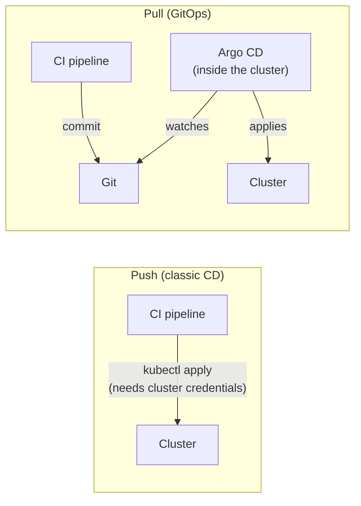

# 11.4 GitOps with Argo CD

So far, changes reached the cluster because someone, or some CI job, ran `kubectl apply` or `helm upgrade`. That works, but it leaves awkward questions. What exactly is running in production right now, and does it match what's in Git? Who changed that setting by hand last Tuesday? How do you rebuild the cluster from nothing after a disaster? **GitOps** answers all three with one rule: **Git is the single source of truth for what runs.** A controller inside the cluster continuously compares the cluster with a Git repository and makes them match, the same reconciliation loop as chapter 10.1, with Git as the desired state. To change production, you change Git, through a pull request, with review, history and one-command revert. This chapter explains the idea, then uses **Argo CD**, the most popular GitOps tool, to deploy snip from this very repository and watch it undo changes made behind its back.

## What you'll learn

- The **GitOps principles**, and **push** vs **pull** deployment.
- **Argo CD**: Applications, **sync**, **health**, **pruning** and **self-healing**.
- How **CI and GitOps split the work**, and how an image update reaches the cluster.
- **Promoting** between environments with pull requests.
- **Secrets** in a GitOps world, and the trade-offs.

---

## The principles

GitOps, as defined by the OpenGitOps project, has four principles:

1. **Declarative**: the whole system is described as desired state (manifests, charts), not as scripts of steps.
2. **Versioned and immutable**: that description lives in Git, so every change has a commit, an author, a review and a way back.
3. **Pulled automatically**: software agents fetch the desired state from Git themselves; nobody pushes into the cluster.
4. **Continuously reconciled**: those agents keep comparing and correcting, not just once at deploy time.

:::note[Everyday anchor]
An architect's **approved blueprint** is kept in the office safe. On site, the foreman compares the building with the blueprint every morning. If a worker moved a wall overnight without approval, it gets moved back. If the client wants a change, the architect updates the blueprint (with a signature and a date), and the foreman builds what's new. Nobody argues about what the building "should" look like: it's whatever the current, signed blueprint says.
:::

### Push vs pull



In **push** deployment, the CI system holds credentials to every cluster it deploys to. That's a powerful secret sitting in a system that also runs third-party code (chapter 11.2). In **pull** deployment, the agent runs **inside** the cluster and only needs **read** access to Git. The CI system never touches the cluster at all. It also works for clusters that the internet can't reach, because they reach out to Git, not the other way around.

---

## Argo CD

**Argo CD** is a Kubernetes controller (installed into the cluster, in the `argocd` namespace) plus a web UI and CLI. Its central object is the **Application**: "keep *this path* in *this Git repository* synced to *this cluster and namespace*". snip's (`snip/deploy/argocd/application.yaml`):

```yaml
apiVersion: argoproj.io/v1alpha1
kind: Application
metadata:
  name: snip
  namespace: argocd
spec:
  project: default
  source:
    repoURL: https://github.com/jawwadzafar/zero-to-prod.git
    targetRevision: main
    path: snip/deploy/k8s/base           # kustomize: Argo CD renders it like kubectl apply -k
  destination:
    server: https://kubernetes.default.svc
    namespace: snip
  syncPolicy:
    automated:
      prune: true
      selfHeal: true
    syncOptions:
      - CreateNamespace=true
      - RespectIgnoreDifferences=true
  ignoreDifferences:                     # the HPA owns the API's replica count (see "What can go wrong")
    - group: apps
      kind: Deployment
      name: api
      jsonPointers:
        - /spec/replicas
```

Argo CD understands plain manifests, kustomize and Helm charts (chapter 10.6). It reports two things for every Application:

| Status | Values | Meaning |
|---|---|---|
| **Sync** | `Synced` / `OutOfSync` | Does the cluster match Git? |
| **Health** | `Healthy` / `Progressing` / `Degraded` / `Missing` | Are the resources actually working (Deployments available, Pods ready)? |

`Synced` but `Degraded` means you deployed exactly what Git says, and what Git says is broken. The fix is another commit.

### The three switches

- **Automated sync**: when Git changes, apply the change without anyone clicking "Sync". Without it, Argo CD shows `OutOfSync` and waits for a human, which is a reasonable choice for production in some teams.
- **`prune: true`**: when a resource is **removed** from Git, delete it from the cluster. Without it, deleted manifests leave orphans behind.
- **`selfHeal: true`**: when someone changes the cluster **directly** (`kubectl edit`, `scale`, `delete`), put it back the way Git says. This is what makes Git truly the source of truth: hand-made changes don't stick.

That last switch changes team habits. Emergency fixes still happen by hand sometimes, but they must also be made in Git, or they're reverted within minutes. Many teams make the cluster effectively read-only for humans, and the whole audit trail is simply `git log`.

---

## CI and GitOps: who does what

GitOps doesn't replace CI; it replaces the *deploy* step:

1. A developer merges a change to snip's code.
2. **CI** tests it and builds and publishes an image, `ghcr.io/…/snip:sha-9f3c2a1` (chapters 9.4 and 11.2).
3. Something updates the **desired state in Git** to use the new tag. It's either a CI step that commits a one-line change to the environment's manifests (`kustomize edit set image …`), or a bot like **Argo CD Image Updater** or **Renovate** that opens a pull request.
4. **Argo CD** notices the Git change and syncs the cluster.

Often the application code and its deployment configuration live in **separate repositories**. That way a configuration change doesn't trigger a code build, and deployment permissions can differ from code permissions. This handbook keeps them together for simplicity.

### Promoting between environments

A common repository layout:

```text
deploy/
├── base/                 # shared manifests
└── envs/
    ├── staging/          # kustomization: base + image sha-9f3c2a1, 1 replica
    └── production/       # kustomization: base + image sha-7b1e0d4, 4 replicas
```

One Argo CD Application per environment points at its directory. **Promotion is a pull request** that copies the tested image tag from `staging` to `production`: reviewed, approved, merged, synced. Rolling back production is **reverting that commit**. The history of every environment is a readable list of pull requests.

---

## Secrets in GitOps

"Everything in Git" collides with "never put secrets in Git" (chapters 7.6 and 10.4). The answer is the same as chapter 10.4's: put **references** or **encrypted** values in Git, never the plaintext.

- **External Secrets Operator**: Git holds an `ExternalSecret` naming the entry in the cloud secret manager; the operator creates the real Secret.
- **Sealed Secrets** / **SOPS**: Git holds encrypted values that only the cluster, or a key in your cloud's KMS, can decrypt.

snip's base manifests contain a development-only password so the labs work anywhere. A real deployment would replace `config.yaml`'s Secret with an `ExternalSecret`.

:::warning[What can go wrong]
- **Fighting self-heal**: an on-call engineer scales a Deployment by hand during an incident, and Argo CD quietly undoes it. Know how to **pause** automated sync for an Application, and put the change in Git afterwards.
- **Autoscaler vs Git**: an HPA changes `replicas`, then Git's `replicas: 2` "corrects" it. Either leave `replicas` out of manifests managed with an HPA, or tell Argo CD to ignore that field with `ignoreDifferences`, as snip's Application does.
- **`prune` surprises**: moving a manifest to a different Application, or a bad kustomize change, can make Argo CD delete things. Review diffs; protect critical resources with sync options.
- **Git becomes critical infrastructure**: if Git is down, you can't change production. That's usually acceptable (the cluster keeps running), but plan for the emergency path.
- **Secrets in plain text in the repository**: the most common GitOps mistake. It's permanent, because Git history remembers.
:::

:::info[In the real world]
GitOps with Argo CD or **Flux** is the default way many organisations run Kubernetes at scale. A platform team manages hundreds of Applications with **ApplicationSets**, which generate one Application per cluster or environment from a template. Progressive delivery (chapter 11.3) plugs in through Argo Rollouts, and the "deploy" button in the developer portal is really a pull request against a config repository. The main win isn't speed: it's that anyone can answer "what's running, who changed it, and how do we undo it?" by reading Git.
:::

---

## Lab

Free, on a kind cluster. This lab runs in snip's CI on every push, on a fresh cluster, with Argo CD syncing the exact commit under test. Use a **new** cluster, so Argo CD's snip doesn't collide with the one from Part 10: `kind create cluster --name gitops`.

:::danger
The clean-up deletes the `gitops` kind cluster and everything in it. Make sure your kubectl context is the lab cluster, not a real one, before you delete anything: `kubectl config current-context` should say `kind-gitops`.
:::

1. **Install Argo CD.**
   ```bash
   kubectl create namespace argocd
   kubectl apply -n argocd --server-side --force-conflicts \
     -f https://raw.githubusercontent.com/argoproj/argo-cd/v3.5.3/manifests/install.yaml
   kubectl -n argocd wait --for=condition=Available deploy --all --timeout=300s
   ```
   `--server-side` is needed because Argo CD's CRDs are too large for the normal client-side apply.

2. **Hand snip to Argo CD.**
   ```bash
   cd ~/code/zero-to-prod/snip
   kubectl apply -f deploy/argocd/application.yaml
   kubectl -n argocd get application snip -w          # OutOfSync/Missing → Synced/Progressing → Synced/Healthy
   ```
   You didn't run `kubectl apply -k`: Argo CD fetched the manifests from GitHub and applied them. (If Health stays `Progressing` or `Degraded` because the HPA can't read metrics, install metrics-server as in chapter 10.5.)

3. **Open the UI.**
   ```bash
   kubectl -n argocd get secret argocd-initial-admin-secret -o jsonpath='{.data.password}' | base64 -d; echo
   kubectl -n argocd port-forward svc/argocd-server 8443:443 &
   ```
   Browse to `https://localhost:8443` (accept the self-signed certificate), log in as `admin` with that password, and open the `snip` Application: a live tree of every object, its sync and health.

4. **Try to change things behind Git's back.**
   ```bash
   kubectl -n snip patch configmap snip-config --type merge -p '{"data":{"SNIP_LOG_LEVEL":"debug"}}'
   sleep 10; kubectl -n snip get configmap snip-config -o jsonpath='{.data.SNIP_LOG_LEVEL}'; echo    # info again
   kubectl -n snip delete deployment worker
   sleep 10; kubectl -n snip get deployment worker                                                   # it's back
   ```
   Self-heal undid both. In the UI, the Application's history shows the syncs that did it.

5. **Make a real change, the GitOps way.** In your **fork** of the repository, change the Application's `repoURL` to your fork and re-apply it. Then edit `snip/deploy/k8s/base/config.yaml` (set `SNIP_LOG_LEVEL: debug`), commit and push to `main`. Within about three minutes (Argo CD's default polling interval) the cluster follows. Revert the commit, and it follows back. Clean up with `kind delete cluster --name gitops`.

## Self-check

<Quiz
  id="shipping-gitops"
  questions={[
    {
      q: 'What is the core rule of GitOps?',
      options: [
        'Keep application code in Git, and cluster settings in the cluster',
        'Git is the source of truth; an agent keeps the cluster matching it',
        'Every change to the cluster needs a ticket that links to a commit',
        'CI must run kubectl apply after each merge to the main branch',
      ],
      answer: 1,
      explain: 'Git is the single source of truth for what runs; an agent continuously makes the cluster match it. Declarative, versioned in Git, pulled automatically, continuously reconciled.',
    },
    {
      q: 'Why is pull-based deployment considered more secure than push-based?',
      options: [
        'It is faster, since the agent is already inside the cluster',
        'CI no longer needs cluster credentials; the agent only reads Git',
        'Git encrypts every manifest, so nobody can tamper with them',
        'The agent checks each commit’s signature before applying it',
      ],
      answer: 1,
      explain: 'The CI system no longer needs credentials to the cluster; the in-cluster agent only needs read access to Git. CI runs lots of third-party code. Keeping cluster credentials out of it removes a big risk.',
    },
    {
      q: 'Someone runs kubectl scale deploy/api --replicas=10 on a cluster managed by Argo CD with selfHeal. What happens?',
      options: [
        'It stays at 10, since a manual change always wins',
        'Argo CD sees the drift and puts back what Git says',
        'Argo CD deletes the Deployment and recreates it from Git',
        'Argo CD commits replicas: 10 to Git, so they match again',
      ],
      answer: 1,
      explain: 'Argo CD detects the drift from Git and scales it back to what Git says. Hand-made changes don’t stick. Change Git instead, or pause sync during an emergency.',
    },
    {
      q: 'An Application shows Synced but Degraded. What does that mean?',
      options: [
        'Argo CD is broken and can’t read the health of resources',
        'The cluster matches Git, but what Git describes isn’t working',
        'Git is unreachable, so Argo CD shows the last known state',
        'The sync is still in progress and some resources are pending',
      ],
      answer: 1,
      explain: 'The cluster matches Git exactly, but the resources aren’t working (e.g. Pods not ready): what Git describes is broken. Sync compares with Git; health checks whether it works. Fix it with a commit.',
    },
    {
      q: 'How is a release promoted from staging to production in a GitOps setup?',
      options: [
        'By clicking deploy in CI, which pushes the image to production',
        'A pull request setting production’s image tag to the one tested',
        'By copying staging’s running Pods into the production namespace',
        'By re-syncing production in Argo CD, which reads staging’s state',
      ],
      answer: 1,
      explain: 'By a pull request that updates production’s desired state (e.g. the image tag) to what was tested in staging. Promotion and rollback become reviewable commits: merge to promote, revert to roll back.',
    },
    {
      q: 'How should secrets be handled when "everything is in Git"?',
      options: [
        'Commit them as they are, to a private repository with few members',
        'Commit references or encrypted values, never plaintext',
        'Commit them base64-encoded, the way Kubernetes Secrets store them',
        'Keep them out of Git and create them by hand with kubectl',
      ],
      answer: 1,
      explain: 'Commit references (External Secrets) or encrypted values (Sealed Secrets, SOPS), never plaintext. Git history is forever. Store the value in a secret manager, and keep only a reference or ciphertext in Git.',
    },
  ]}
/>

<details>
<summary>Walk through a code change to snip reaching production in a GitOps setup with separate staging and production.</summary>

1. A developer opens a PR to snip's code. CI runs tests, builds, scans (chapter 11.2). It's reviewed and merged.
2. On merge, CI builds and publishes `snip:sha-9f3c2a1` with its SBOM (chapter 9.4).
3. An image-updater bot (or a CI step) opens a PR to the **config repository** changing `envs/staging` to `sha-9f3c2a1`. It's auto-merged for staging.
4. Argo CD's **staging** Application sees the commit and syncs; a canary or rolling update runs (chapter 11.3); smoke tests and metrics confirm it's healthy.
5. A **promotion PR** changes `envs/production` to the same `sha-9f3c2a1`. A human reviews and approves it.
6. Argo CD's **production** Application syncs it, ideally through a progressive rollout that aborts on bad metrics.
7. If something goes wrong later, **revert** the promotion commit; Argo CD syncs production back to the previous tag.

Every step is a visible commit or check. The CI system never holds production cluster credentials.

</details>

<details>
<summary>During an incident, the on-call engineer needs to scale snip's API to 20 replicas immediately, but Argo CD keeps setting it back to 2. What should they do?</summary>

The fast path: **pause automated sync** (or self-heal) for that Application in the Argo CD UI or CLI, then scale by hand. Argo CD will show `OutOfSync` but won't revert it. Then make it permanent the right way: a small PR changing the desired state (or the HPA's `maxReplicas`) in Git, merged, and re-enable automated sync. Better still, design it so this isn't needed: let the **HPA** own `replicas` (and tell Argo CD to ignore that field), with limits generous enough for spikes. And put "how to pause sync" in the on-call runbook (chapter 13.5) before the incident, not during it.

</details>
