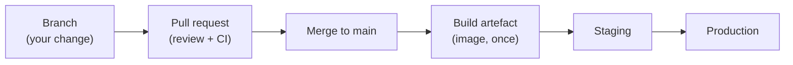

# 11.1 How software ships

Writing code is half the job. The other half is getting it to users **safely, quickly and repeatedly**: tested, packaged, deployed and, if it goes wrong, undone. A few decades ago that meant a release every few months, a weekend of manual steps, and a lot of fear. Today good teams ship many times a day, and each release is small, boring and reversible. The difference isn't bravery. It's a **pipeline**: an automated path every change travels, with checks along the way that catch mistakes while they're cheap. This chapter lays out that path, from a branch on your laptop to production, using this very repository as the example. Its pipeline builds the handbook, tests snip against real Postgres and Redis, runs the whole stack in Docker Compose and in Kubernetes, scans for vulnerabilities, and publishes images. It has caught real mistakes, which you'll read about below.

## What you'll learn

- The **path to production**: branch → pull request → review → CI → artefact → environments → release.
- **Continuous integration**, **continuous delivery** and **continuous deployment**, and how they differ.
- **Artefacts**, **environments**, and "build once, deploy many".
- **Versioning** with semantic versions and immutable tags.
- How to measure delivery: the four **DORA metrics**.

---

## The path to production



:::note[Everyday anchor]
A car factory doesn't build a car and then check whether it works. Every part is inspected as it arrives, every station tests its own step, and a finished car goes through a test track before it's shipped. A problem found at the station costs minutes; the same problem found by a customer costs a recall. A delivery pipeline is the software version of that production line, and the rule is the same: **catch it as early as possible**.
:::

**1. A branch.** Work happens on a short-lived branch off `main` (chapter 3.2), so `main` stays releasable and you can experiment freely.

**2. A pull request (PR).** You propose merging your branch (chapter 3.3). The PR is where two things happen:
- **Code review**: a teammate reads the change. Reviews catch bugs, but just as importantly they spread knowledge and keep the codebase consistent. Small PRs get better reviews: a 50-line change gets read, a 2,000-line change gets skimmed.
- **CI checks**: automated builds and tests run on the PR, and their results show next to it. Repositories usually **protect** `main` so a PR can't merge until checks pass and someone has approved it.

**3. Merge to main.** `main` now contains the change. In **trunk-based development**, the common modern practice, everyone merges small changes to `main` at least daily, and unfinished features hide behind **feature flags** (chapter 11.3) rather than living on long-running branches. Long-lived branches that merge rarely produce painful, risky merges.

**4. Build the artefact, once.** The pipeline builds the deployable thing, snip's container image (chapter 9.4), tags it with the commit, and pushes it to a registry. **This exact artefact** is what gets tested and deployed everywhere afterwards. It's never rebuilt per environment, because a rebuild could differ (newer base image, newer dependency) from what was tested.

**5. Environments.** The same artefact moves through environments that get closer to the real thing:

| Environment | Purpose | Data |
|---|---|---|
| **Local** | Developing and quick checks (Compose, kind) | Fake |
| **CI** | Automated tests on every change, thrown away afterwards | Fake, created per run |
| **Staging** (or pre-production) | Production-like: same configuration shape, real integrations, final checks | Realistic, not real users' |
| **Production** | Real users | Real |

What differs between environments is **configuration** (chapter 10.4): the database address, the log level, the number of replicas. Not the code, and not the image.

**6. Release.** The artefact reaches production, ideally gradually and reversibly (chapter 11.3).

---

## CI, CD and CD

The three terms get blurred, so here's precisely what each means:

| Practice | What happens automatically | Where a human decides |
|---|---|---|
| **Continuous integration (CI)** | Every change is built and tested as soon as it's pushed; everyone integrates into `main` often | Merging the PR |
| **Continuous delivery** | Every change that passes the pipeline produces a **releasable** artefact, deployed to staging automatically | Pressing "deploy to production" |
| **Continuous deployment** | Every change that passes the pipeline goes **all the way to production** | Nowhere: the pipeline is the gate |

Continuous deployment sounds scary, and it only works with a trustworthy pipeline, good monitoring and fast rollback. But it's the logical end of the idea: if a change has passed every check you'd make by hand, making someone press a button adds delay, not safety. Many teams practise continuous delivery for their core services and continuous deployment for lower-risk ones. This handbook's website uses continuous deployment: every push to `main` that passes the build is published to GitHub Pages within minutes.

---

## This repository's pipeline

This repository has three workflows (in `.github/workflows/`), run by GitHub Actions (chapter 11.2):

| Workflow | Runs on | Does |
|---|---|---|
| `ci.yml` | Every push to `main` and every PR | Typechecks and builds the site (PRs); vets and tests snip against real Postgres and Redis; builds snip's image and checks it starts; lints the OpenAPI contract; runs the whole Compose stack end to end; deploys snip to a Kubernetes cluster (kind) and runs every Part 10 lab; scans for vulnerabilities |
| `image.yml` | Pushes to `main` touching `snip/`, and `snip-v*` tags | Builds snip's image for two CPU architectures and publishes it to `ghcr.io` with an SBOM and provenance (chapter 9.4) |
| `deploy.yml` | Every push to `main` | Builds the handbook and deploys it to GitHub Pages (continuous deployment) |

The CI jobs run **in parallel**: each is independent, so a run finishes in the time of the slowest job (a few minutes) rather than the sum of them.

### What it caught

Pipelines prove their worth when they fail. Three real failures from this repository's history, each caught before it reached a reader:

- **A test that tested the wrong thing.** The Compose job's load-balancing check created a short link with the slug `lb`, and failed with HTTP 400. snip requires slugs of 3 to 32 characters (chapter 5.3), so the check itself was wrong, and so was the chapter 8.3 lab that used the same slug. Both were fixed in one commit. Without CI, readers would have hit a confusing 400 while following the lab.
- **A Kubernetes security setting that couldn't be satisfied.** The first time snip's manifests ran on a real cluster, no Pod started: `runAsNonRoot` can't be verified for an image whose user is a *name* (chapter 10.2). The manifests passed every static check; only running them for real found it.
- **A tool that needed a newer toolchain.** The new vulnerability-scan job failed because the scanner's latest release required a newer Go than the one snip is built with (chapter 9.4). The fix was to build the tool with the toolchain it needs, and still analyse snip with its own.

None of these was a bug in snip's Go code. Pipelines catch problems in **everything around the code**: tests, configuration, infrastructure and tooling. That's where many real-world outages come from.

---

## Versions and tags

A release needs a name. Two complementary kinds:

- **Commit-based tags** (`sha-0309539`) identify every build exactly. Deploy these, or digests (chapter 9.4).
- **Semantic versions** (**SemVer**, `MAJOR.MINOR.PATCH`, like `1.4.2`) communicate *meaning* to people and to other software:
  - **PATCH** (1.4.2 → 1.4.3): bug fixes only, nothing breaks.
  - **MINOR** (1.4 → 1.5): new features, nothing breaks.
  - **MAJOR** (1.x → 2.0): something **breaks**, and users must change something to upgrade.

In this repository, pushing a git tag like `snip-v1.2.3` makes `image.yml` publish `ghcr.io/jawwadzafar/snip:1.2.3` and `:1.2`. A **changelog** records what changed in each version, in words people can read. Many teams generate it from commit messages written in a convention like **Conventional Commits** (`feat:`, `fix:`, `docs:`), which is why this repository's commits start that way.

---

## Measuring delivery: the DORA metrics

How do you know whether a team delivers well? Years of research by the **DORA** programme (DevOps Research and Assessment) found four measures that together predict both speed and stability:

| Metric | Question | Strong teams |
|---|---|---|
| **Deployment frequency** | How often do we deploy to production? | On demand, many times a day |
| **Lead time for changes** | How long from commit to running in production? | Less than a day |
| **Change failure rate** | What fraction of deployments cause a problem needing a fix? | Low (roughly 0–15%) |
| **Time to restore service** | How long to recover when something breaks? | Less than an hour |

The key finding: **speed and stability go together.** Teams that deploy small changes often have *fewer* failures and recover faster, because each change is small, easy to review, easy to test and easy to undo. Big, infrequent releases bundle many risks together, and when one goes wrong it's hard to tell which part caused it.

:::warning[What can go wrong]
- **A slow pipeline**: if CI takes an hour, people batch changes and stop waiting for results, and the pipeline stops protecting anything. Keep the main checks to minutes: run jobs in parallel, cache dependencies, and move slow suites to scheduled runs.
- **Flaky tests** that fail randomly: people learn to hit "re-run" and ignore red builds. Fix or quarantine flaky tests immediately; a pipeline nobody trusts is worse than none.
- **Rebuilding per environment**: production runs an artefact that was never tested.
- **Staging that isn't like production** (different versions, sizes, configuration): it passes in staging and fails in production.
- **Manual steps** in the release ("then SSH in and run the migration"): the step that's forgotten at 6 p.m. on a Friday.
:::

:::info[In the real world]
A mature pipeline makes the safe path the easy path. Protected `main`, required checks and reviews, one artefact per commit, automatic deploys to staging, a one-click (or automatic) production release with gradual rollout and automatic rollback on bad metrics (chapter 11.3), and dashboards of the DORA metrics so the team sees whether things are getting better. It's built incrementally: most teams start with "run the tests on every PR", which is already the biggest single win.
:::

---

## Lab

Free, with a browser and your clone of this repository.

1. **Read the pipeline.** Open `.github/workflows/ci.yml` and list its jobs. For each, write one line: what would it catch? Which job would have caught a typo in a Kubernetes manifest? (`snip-k8s`, which applies them to a real cluster.) Which would catch a broken SQL example in a chapter? (`site`, via `npm run check:sql`, on pull requests; the `deploy` workflow runs it too.)

2. **Watch it run.** On GitHub, open the repository's **Actions** tab. Open the latest **CI** run: see the jobs running in parallel, their durations, and the steps inside the Kubernetes job, which match Part 10's labs one to one.

3. **Find a failure and its fix.** In the Actions history, find a red CI run. Open the failed job, read the error, then find the next commit (`git log --oneline`) and read its diff (`git show <commit>`). This is the everyday loop: red, read, fix, green.

4. **Look at the history as a record.**
   ```bash
   cd ~/code/zero-to-prod
   git log --oneline -15                      # small, frequent changes, each with a conventional prefix
   git log --oneline -- snip/deploy/k8s        # the history of just the Kubernetes manifests
   ```

5. **Practise a release, locally.** In your own clone (don't push the tag):
   ```bash
   git tag -a snip-v0.1.0 -m "snip 0.1.0: first tagged release"
   git show snip-v0.1.0 --stat | head -5
   git tag -d snip-v0.1.0                     # delete it again
   ```
   In the real repository, pushing that tag would make `image.yml` publish `snip:0.1.0`. In your own fork, you can try it for real: the workflow publishes to your account's registry.

## Self-check

<Quiz
  id="shipping-how-software-ships"
  questions={[
    {
      q: 'What is the difference between continuous delivery and continuous deployment?',
      options: [
        'They are the same',
        'Delivery makes every passing change releasable and a human decides when to release; deployment releases every passing change to production automatically',
        'Deployment is only for mobile apps',
        'Delivery skips testing',
      ],
      answer: 1,
      explain: 'Both automate everything up to production. The difference is whether the final step is automatic.',
    },
    {
      q: 'Why build the artefact once and promote it through environments, instead of rebuilding for each?',
      options: [
        'To save disk space',
        'A rebuild could differ from what was tested (newer base image or dependency), so production would run something never tested',
        'Registries only allow one push',
        'Rebuilding is slower',
      ],
      answer: 1,
      explain: 'Same bytes everywhere. What changes between environments is configuration.',
    },
    {
      q: 'A version goes from 2.3.1 to 3.0.0. What does SemVer tell users?',
      options: [
        'Only bug fixes',
        'Something breaks: users may need to change their code or configuration to upgrade',
        'New features only',
        'Nothing',
      ],
      answer: 1,
      explain: 'MAJOR bumps signal breaking changes. MINOR adds features compatibly, PATCH fixes bugs.',
    },
    {
      q: 'What did DORA research find about speed and stability?',
      options: [
        'You must trade one for the other',
        'They go together: teams that ship small changes often also have lower failure rates and faster recovery',
        'Stability matters more than speed',
        'Only large companies can have both',
      ],
      answer: 1,
      explain: 'Small changes are easier to review, test and undo. Big releases bundle risk.',
    },
    {
      q: 'Which of these did this repository’s CI catch that static checks alone would have missed?',
      options: [
        'A spelling mistake',
        'Kubernetes Pods that could never start because runAsNonRoot couldn’t be verified for a named image user',
        'A missing semicolon',
        'A slow website',
      ],
      answer: 1,
      explain: 'The manifests were valid YAML and passed schema checks. Only running them on a real cluster revealed the problem.',
    },
    {
      q: 'Your team’s CI takes 70 minutes and people have started merging without waiting. What would you do first?',
      options: [
        'Remove the tests',
        'Make the main checks fast (parallel jobs, caching, moving slow suites to scheduled runs) so waiting is reasonable, and require checks to pass before merging',
        'Add more tests to the same job',
        'Ask people to be more patient',
      ],
      answer: 1,
      explain: 'A pipeline only protects you if people wait for it. Speed is a feature of a pipeline.',
    },
  ]}
/>

<details>
<summary>Design a basic pipeline for snip from scratch. What runs on a pull request, on merge, and on release?</summary>

**On every pull request** (fast, minutes):
- `go vet` and `go test -race` against real Postgres and Redis (service containers).
- Build the image and check it starts (`/healthz`).
- Lint the OpenAPI contract; `govulncheck`.
- Required to pass, plus one approving review, before merge.

**On merge to `main`:**
- The same checks again (the merged result can differ from the PR branch).
- Build the image **once**, tag it `sha-<commit>`, push it with an SBOM.
- Deploy that image to **staging** automatically, run the smoke test against staging, and alert if it fails.

**On release** (a tag like `snip-v1.4.0`, or a button):
- Promote the **same** image (by digest) to production, gradually (chapter 11.3), watching error rates and latency, with automatic rollback if they worsen.
- Publish version tags (`1.4.0`, `1.4`) and the changelog.

**On a schedule** (nightly): slower suites (full end-to-end, load tests), and re-scanning deployed images for newly published vulnerabilities.

</details>

<details>
<summary>Why are feature flags important to trunk-based development?</summary>

Trunk-based development means merging small changes to `main` at least daily. But a feature can take weeks. Feature flags let unfinished work be merged and even deployed **switched off**: the code is in production, but no user sees it until the flag is turned on. That keeps branches short (no painful merges), keeps `main` always releasable, and separates **deploying** code (a technical event) from **releasing** a feature (a business decision). It also allows gradual release: turn the flag on for staff first, then 1% of users, then everyone. And it gives a fast off-switch if the feature misbehaves. Flags need discipline: remove them once a feature is fully launched, or the code fills with dead branches.

</details>
