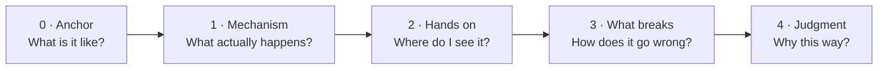
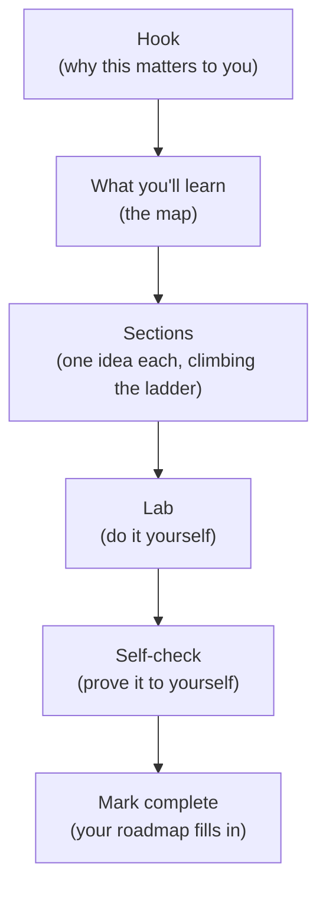
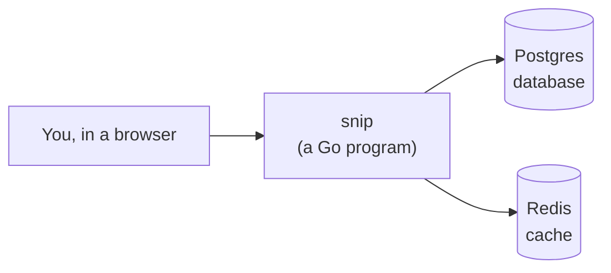

# 0.1 How this handbook works

You've probably tried to learn something technical before and hit a wall: a tutorial that says "simply run this command" and then an error you've never seen, or an explanation that uses three words you'd have to look up to understand the first one. That wall isn't a sign you're not "a tech person." It's a sign someone skipped a step. This chapter shows you how this handbook is built so that **no step is ever skipped** — and how to use it so you actually keep what you learn.

## What you'll learn

- The **ladder**: the five steps every idea in this handbook climbs, from "what is this *like*?" to "why is it built *this* way?"
- How a chapter is laid out, so you always know where you are and what each box on the page means.
- How to **learn** from a chapter rather than just read it: labs, self-checks, and the habit of explaining things out loud.
- What **snip** is, and why building one real system beats a hundred toy examples.
- How to use the interactive parts: quizzes, the in-browser database, progress tracking, and the **💬 Ask** button.

---

## Every idea climbs a ladder

Think about how someone teaches you to drive. Nobody starts by explaining the engine's fuel injection timing. First you learn what the pedals are *for* ("this one goes, this one stops"). Then what they *do*. Then you actually drive around an empty car park. Then you learn what goes wrong — skids, stalls, blind spots. Only after all that do you care *why* cars are designed the way they are.

Every idea in this handbook is taught in that same order. We call it **the ladder**, and it has five rungs:

Here's a real example — the idea of a **port**, which you'll meet properly in chapter 1.4:

| Rung | The question | What you'd read |
|---|---|---|
| **0 · Anchor** | What is this *like*? | An address gets a letter to the right *building*. A port number gets it to the right *apartment* inside. |
| **1 · Mechanism** | What *actually* happens? | One computer runs many programs. Each program that wants network traffic claims a number from 1 to 65535. The operating system hands incoming traffic to whichever program holds that number. |
| **2 · Hands on** | Where do I *see* it? | Your snip server claims port `8080`. You run a command and watch it appear in the list of claimed ports. |
| **3 · What breaks** | How does it go *wrong*? | Start a second copy and it fails with "address already in use" — two programs can't hold the same apartment. You learn how to find the one that's squatting. |
| **4 · Judgment** | Why *this* way? | Why real systems never expose these ports directly, and put a single front door (a reverse proxy) in front instead. |

Two things make the ladder work:

- **You can stop on any rung and still be right.** If you only take in the analogy and the mechanism, what you learned is *true* — just not complete. Nothing later will contradict it.
- **Rungs are never skipped.** If a sentence ever uses a word that hasn't been explained yet, that's a bug in the handbook. Please [report it](https://github.com/jawwadzafar/zero-to-prod/issues/new) — you'll be helping everyone after you.

:::note[Everyday anchor]
Good teaching is like good stairs: each step is small enough that you don't notice the climb, and you look up one day surprised at how high you are. Bad teaching is a ladder with rungs missing. You can sometimes jump the gap — but you shouldn't have to.
:::

---

## How a chapter is laid out

Every chapter follows the same shape, so after two or three you'll navigate them without thinking.

- **The hook** starts from something you already know or have done, and says what you'll be able to do by the end that you can't do today.
- **What you'll learn** is the map. Each bullet already teaches you a sliver, so even skimming it is useful.
- **Sections** each teach one idea. Their headings are *claims* — "A server is a program that never exits" — not labels like "Servers". Read the headings alone and you get the chapter's argument.
- **The Lab** is where it becomes yours. Labs are **free**, and they run **on your own computer** unless a box clearly warns otherwise.
- **The Self-check** asks questions that test understanding, not memory. Answers are hidden until you click, and they explain *why*.

### The coloured boxes

Boxes always mean the same thing, so you can learn to read them at a glance:

:::note[Everyday anchor]
A comparison to something from everyday life. If an idea feels abstract, the anchor box is where to look first.
:::

:::info[If you've written code]
An optional comparison for readers who already program (in JavaScript, Python and so on). **Always skippable** — the chapter makes complete sense without it.
:::

:::tip
A habit worth adopting. Tips are small things experienced engineers do automatically.
:::

:::warning[What can go wrong]
The mistakes people really make, and how to spot them. Engineers learn most of what they know from things breaking; this box lets you learn it for free.
:::

:::danger
Something that can delete data, cost money, or can't be undone. Read these slowly.
:::

---

## Reading is not learning — doing is

Here's an uncomfortable truth about learning anything technical: you can read a chapter, nod along, feel like you understood it — and a day later be unable to do any of it. Researchers call this the **illusion of competence**: familiarity *feels* like understanding, but isn't.

Three habits break the illusion, and this handbook is built around all three:

1. **Do the lab, even when it looks easy.** Typing a command yourself and seeing a *real* result — or a real error — builds a memory that reading never will. When a lab step says "notice…", stop and actually notice.
2. **Answer before you peek.** In every self-check and quiz, commit to an answer *before* revealing it. Getting it wrong and then reading why is one of the most effective ways humans learn. (It's called the **testing effect**, and it's been replicated for over a century.)
3. **Explain it out loud.** After a chapter, try explaining its main idea to someone — or to an empty room — in two minutes, without looking. Wherever you stumble is exactly what to reread.

:::tip[Space it out]
Coming back to a chapter's self-check a few days later is worth more than rereading it three times today. Your [progress page](/progress) keeps track of what you've done, so revisiting is easy.
:::

---

## You'll build one real system: snip

Most tutorials teach with throwaway examples: a to-do app here, a "hello world" there, never connected. You learn fragments, and the hardest part of real engineering — **how the pieces fit together** — is never taught.

This handbook takes the opposite approach. You build **one** system, **snip**, and grow it as you learn:

snip is a **link shortener**: you give it a long web address, it gives you a short one like `snip.example/abc123`, and anyone who visits the short one is sent to the long one. It's small enough to understand completely, but it touches almost everything a real backend does — storing data, handling lots of visitors, counting clicks, keeping out abusers, and staying up.

By the end of your track, snip will run in containers, on Kubernetes, in the cloud, deployed automatically when you push code, watched by dashboards — and, in the AI track, it will have AI features too. Every chapter adds one piece. You'll meet it properly in [0.3 Meet snip](meet-snip.mdx).

---

## The interactive parts

This isn't a book you only read. Four things are built in:

- **🧩 Quizzes.** Multiple choice, with an explanation for *every* answer — including the wrong ones, because a wrong answer tells you exactly which idea to fix. Try the one at the end of this chapter.
- **🐘 A real database in your browser.** In the data chapters, you'll write SQL against a real PostgreSQL database that runs *inside this web page* (compiled to WebAssembly). Nothing to install, nothing sent anywhere.
- **✅ Progress tracking.** Press **Mark chapter complete** at the bottom of each chapter. Your [roadmap](/roadmap) fills in, and you'll always see what's next in your track. It's stored only in your browser — no account needed. You can export it on the [progress page](/progress).
- **💬 Ask the handbook.** Press the **Ask** button in the corner (or <kbd>Ctrl</kbd>/<kbd>⌘</kbd> + <kbd>J</kbd>) and ask a question in plain words. You'll get the handbook sections that answer it. If you add your own AI API key in its settings, you'll also get a tutor-style written answer that cites those sections.

:::warning[What can go wrong]
- **Progress disappears.** It lives in your browser's storage, so clearing site data, using a private window, or switching devices won't carry it over. Export it from the progress page if you care about keeping it.
- **Rushing the foundations.** Parts 1–3 can feel slow if you're eager to build. They're the part most self-taught engineers skip — and it shows in every interview and every outage. Don't skip them; skim them if you must.
:::

---

## How long it takes

Each chapter shows an estimated time. Most take **25–50 minutes** including the lab. A realistic pace:

| Pace | Time per week | A full track takes about |
|---|---|---|
| Steady | 5 hours | 5–7 months |
| Serious | 10 hours | 3–4 months |
| Full-time | 30+ hours | 5–8 weeks |

There's no prize for speed. The engineers who do best are the ones who **finish** — and people who finish are the ones who set a small, regular slot and protect it. Thirty minutes a day beats five hours every other Sunday.

---

## Lab

No setup needed — this one happens right here, in your browser.

1. **Pick your track.** Open the [roadmap](/roadmap) and choose the track closest to where you want to end up. Don't agonise — you can change it any time, and the first four parts are shared by everyone.
   Notice how the chapters outside your track fade but stay clickable. Nothing is locked.
2. **Try the Ask button.** Press **💬 Ask** (bottom-right) and type: *what is the ladder?* Notice that it points you back to sections of *this* chapter — it searches the handbook itself.
3. **Answer the quiz below**, committing to each answer before you click. Then mark this chapter complete and watch your roadmap update.

## Self-check

<Quiz
  id="start-how-this-handbook-works"
  questions={[
    {
      q: 'You read an explanation of databases and it uses the word "index" without explaining it. According to how this handbook works, what does that mean?',
      options: [
        'You should have known it — it is a basic term',
        'A rung was skipped — it is a bug in the handbook worth reporting',
        'You should skip ahead to the advanced chapters',
        'Indexes are optional knowledge',
      ],
      answer: 1,
      explain: 'Every term must be explained (anchor, then mechanism) before it is used. A term used before it is taught is a missing rung — a bug in the handbook, not a gap in you.',
    },
    {
      q: 'What is the correct order of the ladder?',
      options: [
        'Mechanism → Anchor → Judgment → Hands on → What breaks',
        'Hands on → Mechanism → Anchor → What breaks → Judgment',
        'Anchor → Mechanism → Hands on → What breaks → Judgment',
        'Judgment → What breaks → Hands on → Mechanism → Anchor',
      ],
      answer: 2,
      explain: 'Start from what it is like (anchor), then what actually happens (mechanism), then see it for real (hands on), then how it fails (what breaks), and finally why it is designed this way (judgment).',
    },
    {
      q: 'You read a chapter and it all made sense. Why does this handbook still insist on the lab and the self-check?',
      options: [
        'To make chapters longer',
        'Because familiarity feels like understanding but is not — doing and self-testing is what makes it stick',
        'Because the labs contain extra content not in the chapter',
        'They are optional and only for advanced readers',
      ],
      answer: 1,
      explain: 'That is the "illusion of competence". Doing (the lab) and retrieving from memory (the self-check, before peeking) are what turn recognition into real skill.',
    },
    {
      q: 'Why does the handbook build one system (snip) instead of many small examples?',
      options: [
        'Because one system is easier to write',
        'Because the hardest real-world skill is how the pieces fit together, which isolated examples never teach',
        'Because link shorteners are the most common kind of software',
        'Because examples are not allowed in technical writing',
      ],
      answer: 1,
      explain: 'Isolated examples teach fragments. Growing one real system teaches how storage, caching, queues, deployment and monitoring connect — which is what the job actually is.',
    },
  ]}
/>

In your own words: why can you stop on any rung and still be "right"?

Because each rung is **true on its own** — it's just not complete. The anchor ("a port is an apartment number") and the mechanism ("programs claim numbers, the operating system routes traffic to them") are simplifications, but nothing later contradicts them. Later rungs *add* detail and judgment; they never tell you the earlier rung was wrong. That's a deliberate rule of how every chapter is written.

Where does your progress live, and what's one way to lose it?

In **your browser's local storage** — on this device only, with no account. You can lose it by clearing site data, using a private/incognito window, or moving to another device or browser. The fix is to **export** it from the [progress page](/progress) and import it wherever you need it.

