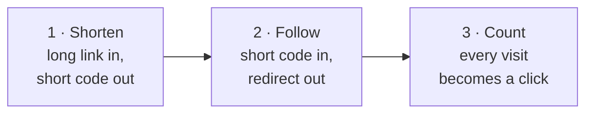
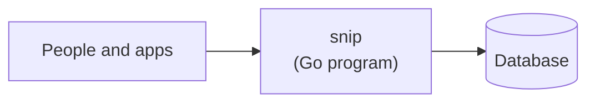
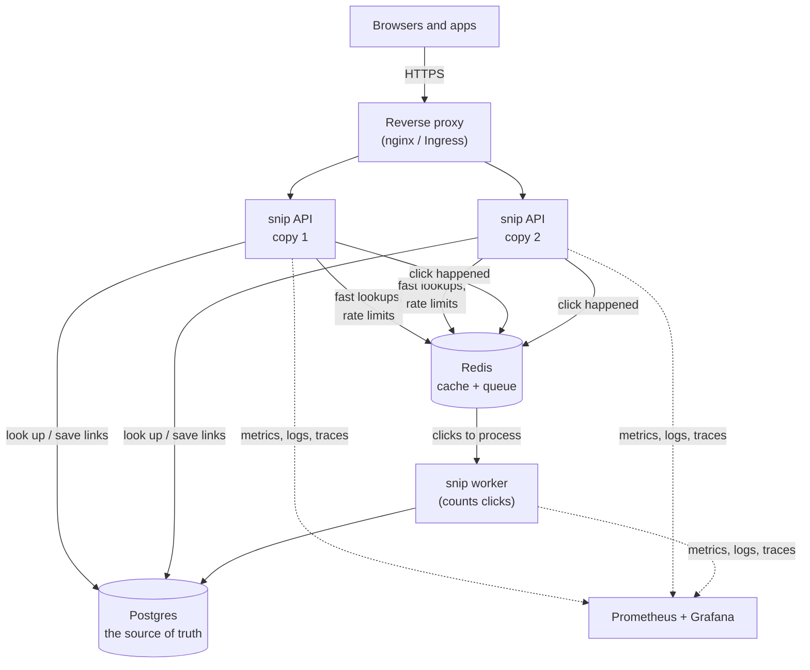

# 0.3 Meet snip, the system you'll build

You've clicked a short link before — something like `bit.ly/3xYz` in a text message or a social post — and landed on a long, messy web address. Behind that one click, a program looked up a code, decided where to send you, counted your visit, and did it in a few thousandths of a second, while millions of other people did the same. That program is a **link shortener**, and you're going to build one. It's called **snip**, and this chapter is a tour of what it will become.

## What you'll learn

- What snip **does**, from the point of view of someone using it: shorten a link, follow a link, see how many clicks it got.
- Why a link shortener is the perfect teaching project: it's **small enough to understand completely** and **big enough to need almost everything** real systems need.
- The **shape** of snip at the end of the handbook — a program, a database, a cache, a queue, a worker — and which part of the handbook adds each piece.
- How snip grows in **versions** (v0 → v5), so you always have something that works.
- Where the finished **reference code** lives, and how to use it without spoiling your own learning.

---

## What snip does, in three moves

From the outside, snip does three things. Everything else in this handbook is about doing them *well*: fast, safely, reliably, and at scale.



1. **Shorten.** You send snip a long address such as `https://example.com/blog/2026/how-we-migrated-our-database-without-downtime`. snip makes up a short, unique code — say `k7Qz2a` — remembers the pair, and gives you back `https://snip.example/k7Qz2a`.
2. **Follow.** When anyone visits `https://snip.example/k7Qz2a`, snip looks up `k7Qz2a` and tells their browser "the page you want is over *there*" — a **redirect**. Their browser goes to the long address automatically. They barely notice snip was involved.
3. **Count.** Each visit is recorded as a **click**, so the link's owner can see how many people used it.

That's the whole product. You could describe it on a sticky note.

:::note[Everyday anchor]
snip is a **coat check**. You hand over your coat (a long link) and get a small numbered ticket (the short code). Anyone with the ticket can get the coat back. The coat check also keeps a tally of how many times each ticket was used. Simple — until ten thousand people arrive at once, someone tries to forge tickets, the ticket book fills up, and the power goes out. Handling *that* is engineering.
:::

---

## Why a link shortener teaches almost everything

A tiny product with a sticky-note description turns out to touch nearly every hard problem in backend and operations work. Here's what each innocent-looking question forces you to learn:

| The question | What it forces you to learn | Where |
|---|---|---|
| How does a browser even reach snip? | Networks, addresses, ports, HTTP | Part 1 |
| Where do we write snip, and how do we run it? | A programming language, the terminal, Linux | Parts 2 & 4 |
| How do other programs ask snip to shorten a link? | Designing an **API** (a menu of requests a program accepts) | Part 5 |
| Where are links kept so they survive a restart? | Databases and SQL | Part 6 |
| Redirects must be instant, even with millions of links. How? | Indexes and caching | Part 6 |
| How do we stop strangers deleting your links, or spammers flooding snip? | Authentication, authorisation, rate limiting, web attacks | Parts 7 & 8 |
| Counting clicks shouldn't slow redirects down. How? | Queues and background workers | Part 8 |
| How do we run it the same way on every machine? | Containers | Part 9 |
| How do we run many copies so one crash doesn't take it down? | Kubernetes, load balancing | Parts 8 & 10 |
| How does new code reach users safely, many times a day? | CI/CD, deployment strategies | Part 11 |
| Where does it run in the real world, and what does it cost? | The cloud, Terraform | Part 12 |
| How do we know it's healthy at 3 a.m.? | Logs, metrics, traces, alerts | Part 13 |
| Can snip summarise and tag the pages it links to, and let you search them by meaning? | Large language models, embeddings, RAG, evals | Part 14 |

That's the whole handbook, driven by one product. Every chapter answers a question snip actually has.

---

## The shape of snip at the end

Start with the small picture — it's all you need for now:



People (and other programs) talk to snip; snip remembers links in a database. That's version 1, more or less. Here's the fuller picture of where you'll end up:



Two things in that picture matter most:

- **There's more than one copy of snip.** If one crashes, the other keeps serving. The **reverse proxy** in front decides which copy handles each visitor. (Part 8.)
- **Following a link and counting a click are separated.** When you visit a short link, snip redirects you *immediately* and just drops a note — "a click happened" — into a **queue**. A separate program, the **worker**, picks up those notes and updates the counts. Your visit never waits for the counting. (Part 8.)

Don't worry if words like *cache*, *queue* or *reverse proxy* are new. Each one gets the full ladder — everyday anchor first — in the chapter that introduces it.

---

## snip grows in versions, so it always works

You won't build that big picture in one go. snip grows in versions, and **every version runs**. You're never stuck with a half-built thing that does nothing.

| Version | What's new | You learn it in |
|---|---|---|
| **v0** | A Go program that shortens and follows links, keeping them in memory (forgotten on restart). | 5.1 |
| **v1** | A proper API with validation and errors, links stored in **Postgres** so they survive restarts. | Parts 5–6 |
| **v2** | **Redis** cache for fast redirects; click counting through a **queue** and **worker**; API keys and rate limiting. | Parts 6–8 |
| **v3** | Packaged in **containers**; the whole stack starts with one command. | Part 9 |
| **v4** | Running on **Kubernetes**, deployed automatically by **CI/CD**, infrastructure described in **Terraform**. | Parts 10–12 |
| **v5** | **Observable** (metrics, logs, traces, alerts) — and, on the AI track, **AI features** (summaries, tags, search by meaning). | Parts 13–14 |

---

## The reference code: use it like an answer key

The finished snip lives in this handbook's repository, in the [`snip/` folder on GitHub](https://github.com/jawwadzafar/zero-to-prod/tree/main/snip). Every snippet of snip code in a chapter is copied from that real, tested code.

Treat it like the answer key at the back of a textbook:

- **Type your own version first**, following the chapter. Typing it yourself — and fixing your own typos — is where the learning happens.
- **Compare afterwards.** If yours doesn't work, diff it against the reference to find the difference.
- **Don't copy-paste whole files.** You'd end up with a working program and no idea why it works — the exact opposite of what this handbook is for.

:::warning[What can go wrong]
- **Skipping ahead to the "cool" parts.** Kubernetes and AI features are exciting, but on top of a program you don't understand, they're magic spells. Every version builds on the one before; the order is the point.
- **Treating snip as a toy.** It's small, but it's built the way real services are: tested, configurable, observable. The habits you practise on it are the habits interviewers and teammates look for.
:::

:::info[In the real world]
Real link shorteners (Bitly, TinyURL, the ones built into social networks) are a classic **system design interview** question precisely because they look simple and aren't. By Part 15 you'll be able to design one at the scale of billions of clicks — and explain every trade-off — because you'll have built one.
:::

---

## Lab

Two minutes, in your browser and terminal. Free.

1. **See a redirect happen.** Open your terminal and ask a real website for a page *without* following redirects:
   ```bash
   curl -sI http://github.com    # -I = only show the response headers; -s = no progress bar
   ```
   Look for two lines near the top: `HTTP/1.1 301 Moved Permanently` and `Location: https://github.com/`. That's a redirect — the server saying "not here, go *there*". snip will send exactly this kind of answer, pointing at your long link. (`curl` is a tool for talking to web servers from the terminal; it's preinstalled on macOS and most Linux systems — on WSL, run `sudo apt install -y curl` if it's missing.)

2. **Look at the finished code — just look.** Open the [`snip/` folder on GitHub](https://github.com/jawwadzafar/zero-to-prod/tree/main/snip) and browse. You won't understand most of it yet, and that's the point: come back after Part 5 and notice how much of it reads like plain English.

3. **Write down your "why".** In one sentence, write why you're doing this — the job you want, the thing you want to build, the person you want to be able to explain things to. Put it somewhere you'll see it. You'll want it around chapter 6.5.

## Self-check

<Quiz
  id="start-meet-snip"
  questions={[
    {
      q: 'When someone visits a snip short link, what does snip send back?',
      options: [
        'The web page the long link points to',
        'A redirect: a response telling the browser to go to the long address',
        'A list of all the links snip knows',
        'A copy of the short code',
      ],
      answer: 1,
      explain: 'snip never serves the destination page itself. It answers with a redirect (like the 301 you saw from github.com), and the browser then fetches the long address on its own.',
    },
    {
      q: 'Why does snip count clicks through a queue and a separate worker instead of updating the count during the redirect?',
      options: [
        'Because databases cannot count',
        'So the visitor is redirected immediately and never waits for the counting',
        'Because queues are more secure',
        'Because the worker is written in a different language',
      ],
      answer: 1,
      explain: 'The redirect is what the visitor cares about, so it must be instant. Dropping a "click happened" note in a queue takes almost no time; the worker does the slower counting in the background.',
    },
    {
      q: 'Why does the finished snip run more than one copy of the API?',
      options: [
        'To use more memory',
        'So that if one copy crashes or is busy, the others keep serving visitors',
        'Because Go programs can only handle one request at a time',
        'So each copy can store different links',
      ],
      answer: 1,
      explain: 'Multiple copies behind a reverse proxy give you both resilience (a crash does not take the service down) and capacity (more visitors at once). They share the same database, so every copy knows every link.',
    },
    {
      q: 'What is the best way to use the reference code in the snip/ folder?',
      options: [
        'Copy each file into your project before reading the chapter',
        'Ignore it completely',
        'Write your own version following the chapter, then compare with the reference to find differences',
        'Only read it after finishing the whole handbook',
      ],
      answer: 2,
      explain: 'Like an answer key: attempt it yourself first (that is where learning happens), then compare. Copy-pasting gives you working code and no understanding.',
    },
  ]}
/>

<details>
<summary>Describe snip to a friend in two sentences, without any technical words.</summary>

Something like: "It turns a long web address into a short one you can share. When someone uses the short one, it sends them to the right place and keeps a count of how many people did."

If you could say that, you already understand the product. Everything else is about making it fast, safe and reliable.

</details>

<details>
<summary>Which single part of the snip picture do you think would cause the most trouble if it broke, and why?</summary>

There's no single right answer — this is a judgment question, and Part 15 teaches you to argue it properly. A strong answer usually picks **Postgres**, because it's the **source of truth**: if the cache (Redis) is lost, snip can rebuild it from Postgres; if a worker dies, clicks wait in the queue; if one API copy dies, others serve. But if Postgres loses data, those links are gone. That's why Part 6 spends so long on databases, and Part 12 on backups.

</details>
