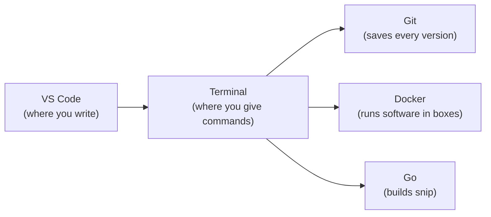

# 0.2 Set up your machine

Every craft has a workbench. A carpenter doesn't start a table by hunting for a saw; the tools hang on the wall, sharp, in reach. This chapter builds your workbench: **five free tools** that every later chapter assumes you have. It takes about 40 minutes, most of it waiting for downloads. By the end you'll have run your first commands and proved each tool works — a small but real thing: you'll have made a computer do exactly what you told it to.

## What you'll learn

- What a **terminal** is — a window where you type instructions instead of clicking — and how to open one.
- Why engineers use a **code editor** (we'll use VS Code), and how it differs from a word processor.
- What **Git** (saves every version of your work), **Docker** (runs software in sealed boxes) and **Go** (the language snip is written in) are each for — the details come later.
- How to **install** each one on macOS, Windows or Linux, and how to **check** that it worked.
- The most useful habit when something goes wrong: **read the error message, then search for it exactly.**

:::tip[Install only what a chapter needs]
This chapter installs the core five. Later chapters install their own extras (a Kubernetes tool, a load tester) at the moment you need them, with instructions. You won't install anything "just in case."
:::

---

## Your computer is about to become a workshop

Here's what we're installing and how the pieces relate:



- **The terminal** is where you give the computer typed instructions. Almost every tool in this handbook is driven from it.
- **VS Code** is where you read and write code. It has a terminal built in, so you'll often use both in one window.
- **Git** keeps a history of every change to your project, so you can undo mistakes and work with others.
- **Docker** runs other people's software (like a database) in a sealed box, without installing it permanently.
- **Go** is the programming language you'll build snip with.

Each gets whole chapters later. Right now you only need to know what each one is *for*.

:::note[Everyday anchor]
Think of a kitchen. The **terminal** is you calling out orders. **VS Code** is the notebook where you write recipes. **Git** is a photo of every version of every recipe, so you can go back to Tuesday's. **Docker** is a set of sealed lunchboxes: you can bring in a dish someone else cooked without it making a mess of your fridge. **Go** is the oven that turns a recipe into food.
:::

---

## Step 1: Open a terminal

A **terminal** is a text window that passes what you type to a program called a **shell**, which runs your command and prints the result. Chapter 2.1 explains exactly how. For now, just open one.

<Tabs groupId="os">
<TabItem value="mac" label="macOS">

Press <kbd>⌘</kbd> + <kbd>Space</kbd>, type **Terminal**, and press <kbd>Enter</kbd>. A window appears with a line ending in `%`. That's the **prompt** — the terminal saying "ready, type something."

</TabItem>
<TabItem value="windows" label="Windows">

Engineers on Windows usually work inside **WSL** (Windows Subsystem for Linux) — a real Linux system running alongside Windows. Servers run Linux, so learning on Linux means everything in this handbook works exactly as written.

1. Click Start, type **PowerShell**, right-click it and choose **Run as administrator**.
2. Type this and press <kbd>Enter</kbd>:
   ```powershell
   wsl --install
   ```
3. Restart when asked. After the restart an **Ubuntu** window opens and asks you to choose a username and password. Pick ones you'll remember — you'll need the password when installing things.
4. From now on, open **Ubuntu** from the Start menu whenever this handbook says "open a terminal". Every command in this handbook runs there.

</TabItem>
<TabItem value="linux" label="Linux">

Press <kbd>Ctrl</kbd> + <kbd>Alt</kbd> + <kbd>T</kbd> (Ubuntu and most desktops), or find **Terminal** in your applications menu. The line ending in `$` is the prompt.

</TabItem>
</Tabs>

Now type your first command and press <kbd>Enter</kbd>:

```bash
echo "hello, workshop"   # echo prints back whatever you give it
```

The terminal prints `hello, workshop`. You told a computer to do something in words, and it did. Every command in this handbook works the same way: **type it, press Enter, read what comes back.**

:::info[If you've written code]
`echo` is the shell's `console.log` or `print`. The terminal is a REPL (read–evaluate–print loop), like a browser console or a Python prompt — except it evaluates commands against the whole operating system.
:::

---

## Step 2: Install a package manager

A **package manager** is an app store for the terminal: one command finds a tool, downloads it and installs it properly. It saves you hunting for download links, and later it updates everything with one command.

<Tabs groupId="os">
<TabItem value="mac" label="macOS">

macOS's package manager is **Homebrew**. Install it by pasting the one-line command from its official site, [brew.sh](https://brew.sh), into your terminal. It asks for your Mac password (typing shows nothing — that's deliberate) and may install Apple's command-line developer tools.

When it finishes, read the last lines: it usually asks you to run two commands under **"Next steps"** so the terminal can find `brew`. Run them. Then check:

```bash
brew --version    # prints "Homebrew 4.x.x" if it worked
```

</TabItem>
<TabItem value="windows" label="Windows (WSL)">

Inside your Ubuntu terminal, the package manager **apt** is already there. Refresh its list of available software:

```bash
sudo apt update     # "sudo" = run as administrator; asks your Ubuntu password
sudo apt upgrade -y # install available updates; -y answers "yes" to prompts
```

</TabItem>
<TabItem value="linux" label="Linux">

Ubuntu and Debian use **apt** (Fedora uses `dnf`; the ideas are the same):

```bash
sudo apt update
sudo apt upgrade -y
```

</TabItem>
</Tabs>

:::warning[What can go wrong]
- **"command not found: brew"** right after installing — you skipped the "Next steps" lines Homebrew printed. Scroll up and run them, then open a new terminal.
- **Typing your password shows nothing.** That's a security feature, not a frozen terminal. Type it and press Enter.
:::

---

## Step 3: Install VS Code

A **code editor** is a word processor built for code. It never adds hidden formatting (a word processor would silently turn your straight quotes into curly ones and break everything), it colours code so you can read it, and it understands the languages you write.

Download **Visual Studio Code** from [code.visualstudio.com](https://code.visualstudio.com) and install it like any app.

- **Windows:** install it on *Windows* (not inside Ubuntu), then add the **WSL** extension from the Extensions panel. From your Ubuntu terminal, `code .` will open VS Code connected to your Linux files.
- **macOS:** open VS Code, press <kbd>⌘</kbd> + <kbd>Shift</kbd> + <kbd>P</kbd>, type **shell command**, and choose **Install 'code' command in PATH**. Now `code .` works from the terminal.

Then install two extensions (the four-squares icon on the left): **Go** (by the Go Team at Google) and **Docker** (by Microsoft).

```bash
code --version   # prints a version number like 1.9x.x
```

---

## Step 4: Install Git

**Git** records snapshots of your project over time. Whenever you reach a good point, you save a snapshot — a **commit** — with a note about what changed. You can return to any snapshot, see exactly what changed between two, and share your work. Part 3 teaches it properly.

<Tabs groupId="os">
<TabItem value="mac" label="macOS">

```bash
brew install git
```

</TabItem>
<TabItem value="windows" label="Windows (WSL)">

```bash
sudo apt install -y git
```

</TabItem>
<TabItem value="linux" label="Linux">

```bash
sudo apt install -y git
```

</TabItem>
</Tabs>

Then tell Git who you are. Every snapshot is labelled with this name and email:

```bash
git config --global user.name "Your Name"          # your name or handle
git config --global user.email "you@example.com"   # the email of your GitHub account
git config --global init.defaultBranch main         # call new projects' first branch "main"
git --version                                       # prints "git version 2.x"
```

While you're here, create a free account on [github.com](https://github.com) if you don't have one. You'll use it to store snip and, later, to run automatic checks on it.

---

## Step 5: Install Docker

**Docker** runs software inside **containers**: sealed boxes that carry a program *and everything it needs* — the right files, versions and settings. When a chapter needs a database, you won't install the database on your computer; you'll start it in a box with one command and throw the box away afterwards. Part 9 explains how the boxes actually work.

<Tabs groupId="os">
<TabItem value="mac" label="macOS">

Install **Docker Desktop** from [docker.com/products/docker-desktop](https://www.docker.com/products/docker-desktop/), choosing Apple chip or Intel chip to match your Mac (Apple menu → About This Mac tells you which). Open it once and wait until it says it's running.

</TabItem>
<TabItem value="windows" label="Windows (WSL)">

Install **Docker Desktop** for Windows from [docker.com/products/docker-desktop](https://www.docker.com/products/docker-desktop/). In its settings, make sure **Use the WSL 2 based engine** is on, and under **Resources → WSL integration** switch on your Ubuntu distribution. Now `docker` works inside your Ubuntu terminal.

</TabItem>
<TabItem value="linux" label="Linux">

Install **Docker Engine** with the official convenience script, then allow your user to run Docker without `sudo`:

```bash
curl -fsSL https://get.docker.com | sh    # download and run Docker's official installer
sudo usermod -aG docker $USER             # add yourself to the "docker" group
```

Log out and back in (or restart) so the group change takes effect.

</TabItem>
</Tabs>

:::info[In the real world]
Docker Desktop is free for personal use, education and small businesses; larger companies need a paid plan. Free alternatives — **Podman Desktop**, **Rancher Desktop**, or **OrbStack** on macOS — run the same containers, and every command in this handbook works with them.
:::

Check it. This downloads a tiny test container and runs it:

```bash
docker --version              # prints "Docker version 2x.x"
docker run --rm hello-world   # prints "Hello from Docker!" plus an explanation
```

If you see **Hello from Docker!**, your computer just downloaded a program someone else packaged, ran it in a sealed box, and cleaned up afterwards (`--rm` means "remove the box when it exits"). You'll do the same with a real database in Part 6.

---

## Step 6: Install Go

**Go** is the programming language you'll build snip with. A huge amount of backend and infrastructure software is written in it — Docker and Kubernetes themselves are Go programs. It's small enough to learn quickly and strict enough to catch many mistakes before your program ever runs. Chapter 4.1 explains why we chose it.

<Tabs groupId="os">
<TabItem value="mac" label="macOS">

```bash
brew install go
```

</TabItem>
<TabItem value="windows" label="Windows (WSL)">

The Go in `apt` is often out of date, so install the official release. Find the current version at [go.dev/dl](https://go.dev/dl) (for example `1.24.7`) and put it in the first line:

```bash
GO_VERSION=1.24.7                                                   # latest from go.dev/dl
curl -fsSLO https://go.dev/dl/go${GO_VERSION}.linux-amd64.tar.gz     # download it
sudo rm -rf /usr/local/go && sudo tar -C /usr/local -xzf go${GO_VERSION}.linux-amd64.tar.gz   # unpack into /usr/local/go
echo 'export PATH=$PATH:/usr/local/go/bin:$HOME/go/bin' >> ~/.bashrc # tell the shell where Go lives
source ~/.bashrc                                                    # reload settings now
```

On an ARM machine, replace `amd64` with `arm64`.

</TabItem>
<TabItem value="linux" label="Linux">

Same as WSL — install the official release from [go.dev/dl](https://go.dev/dl):

```bash
GO_VERSION=1.24.7
curl -fsSLO https://go.dev/dl/go${GO_VERSION}.linux-amd64.tar.gz
sudo rm -rf /usr/local/go && sudo tar -C /usr/local -xzf go${GO_VERSION}.linux-amd64.tar.gz
echo 'export PATH=$PATH:/usr/local/go/bin:$HOME/go/bin' >> ~/.bashrc
source ~/.bashrc
```

</TabItem>
</Tabs>

```bash
go version   # prints "go version go1.2x.x ..."
```

:::note[On the AI track?]
The AI Engineering track (Part 14) also uses **Python**. Chapter 14.1 installs it when you get there — nothing to do now.
:::

---

## When something goes wrong (it will — that's normal)

Installing developer tools is where most beginners first meet a wall of red text. Here's the most valuable habit in this entire handbook:

1. **Read the error slowly, to the end.** Error messages look scary but are usually specific. The most useful line is often the *last* one, or the first containing `error:`.
2. **Copy the exact message and search for it**, in quotes. Thousands of people have hit the same error; the answer is usually among the first results.
3. **Change one thing at a time**, then retry. If you change three things and it works, you don't know which one fixed it.

:::warning[What can go wrong]
- **`command not found` right after installing something.** Your terminal loaded its settings *before* the install. Close it and open a new one — this fixes it more often than anything else.
- **Pasting commands from the web without reading them.** Only paste from sources you trust (like the official sites linked here), and read the command first. A command can delete files as easily as install them.
- **Mixing Windows and WSL.** On Windows, run every handbook command in the **Ubuntu** terminal, and keep projects inside Linux (e.g. `~/code`), not under `/mnt/c/...` — it's much faster and avoids permission surprises.
:::

---

## Lab

Everything here is free and runs on your own computer.

1. **Run the full check.** In a new terminal, run each line and confirm it prints a version, not an error:
   ```bash
   git --version        # Git
   docker --version     # Docker
   go version           # Go
   code --version       # VS Code
   ```
   Notice every tool answers the same question the same way. That's a convention: most command-line tools print their version with `--version`.

2. **Make your workspace.** Create a folder for everything you'll build and open it in VS Code:
   ```bash
   mkdir -p ~/code/zero-to-prod   # make the folder (and any missing parent folders)
   cd ~/code/zero-to-prod          # move into it
   code .                          # open this folder in VS Code ("." means "here")
   ```
   Open **Terminal → New Terminal** inside VS Code and notice it starts in this folder already.

3. **Run a real database for ten seconds.** A preview of Part 6 — don't worry about the details:
   ```bash
   docker run --rm postgres:16-alpine postgres --version   # prints "postgres (PostgreSQL) 16.x"
   ```
   Notice you never installed PostgreSQL. Docker downloaded it in a box, ran one command inside, and threw the box away.

## Self-check

<Quiz
  id="start-set-up-your-machine"
  questions={[
    {
      q: 'You just installed a tool, but the terminal says "command not found". What should you try first?',
      options: [
        'Reinstall the tool',
        'Restart your whole computer',
        'Close the terminal and open a new one',
        'Look for a different tool that does the same job',
      ],
      answer: 2,
      explain: 'A terminal reads its settings (including where to look for programs) when it opens. One opened before the install does not know the new tool exists. A fresh terminal usually fixes it — restarting the whole computer works too, but is overkill.',
    },
    {
      q: 'What does Docker let you do in this handbook?',
      options: [
        'Write Go code faster',
        'Run software such as a database in a sealed box, without installing it permanently',
        'Save snapshots of your code',
        'Host your website for free',
      ],
      answer: 1,
      explain: 'Docker runs software in containers — sealed boxes carrying everything the program needs. Saving snapshots is Git; writing code is VS Code and Go.',
    },
    {
      q: 'Why do Windows users work inside WSL (Ubuntu) for this handbook?',
      options: [
        'Windows cannot run a terminal',
        'Servers almost always run Linux, so learning on Linux means every command works as written',
        'WSL is faster at everything',
        'Go only runs on Linux',
      ],
      answer: 1,
      explain: 'Windows has terminals, and Go runs on Windows. But the servers you will deploy to run Linux, and this handbook assumes Linux commands. WSL gives you real Linux alongside Windows.',
    },
    {
      q: 'A command fails with a long red error. What is the most effective first move?',
      options: [
        'Try random fixes until something works',
        'Read the error to the end, then search for the exact message in quotes',
        'Ignore it and run the next command',
        'Delete everything and start again',
      ],
      answer: 1,
      explain: 'Error messages are usually specific, and someone has almost certainly hit yours before. Reading all of it and searching the exact text finds the fix fastest. Random changes hide which one actually worked.',
    },
  ]}
/>

<details>
<summary>In one sentence each: what are the terminal, Git, Docker and Go for?</summary>

- **Terminal:** a text window where you type commands for the computer to run.
- **Git:** a history of every saved version of your project, so you can go back, compare and share.
- **Docker:** runs software in sealed boxes (containers), so you can use things like a database without installing them permanently.
- **Go:** the programming language you'll build snip with.

</details>

<details>
<summary>Why does <code>docker run --rm hello-world</code> leave nothing behind?</summary>

Because `--rm` tells Docker to **remove the container when it exits**. The downloaded *image* (the template the box is made from) stays cached so the next run is fast, but the box itself is thrown away. That habit — create, use, discard — is how you'll run databases and other services in this handbook without cluttering your computer.

</details>
