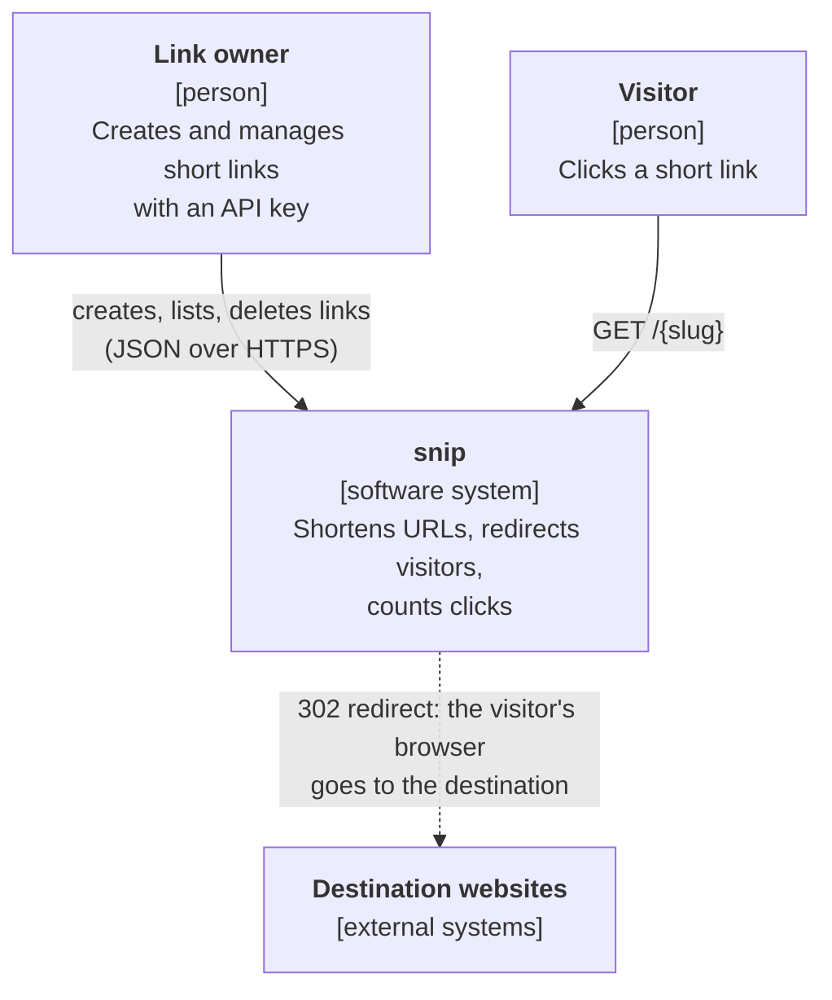
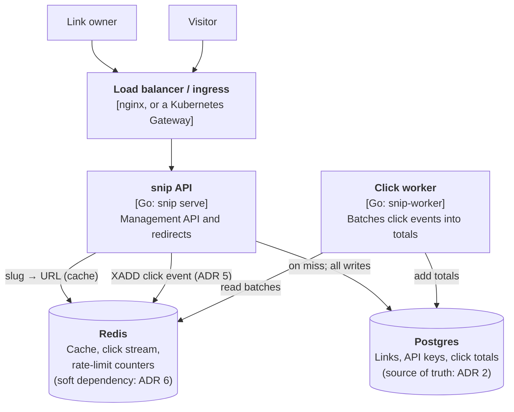

# snip's architecture

Two diagrams in the [C4 model](https://c4model.com/)'s style: **context** (snip
and the people and systems around it) and **containers** (the separately
running pieces inside it). The *why* behind them is in [the ADRs](adr/).

## Level 1: system context

## Level 2: containers

Each snip API copy is stateless, so the API scales by running more copies
behind the load balancer. The worker runs separately so click processing can
fall behind, or be restarted, without affecting redirects.

(Levels 3 and 4 of C4, components and code, are the package layout under
`internal/` and the code itself; handbook chapter 5.4 walks through them.)
